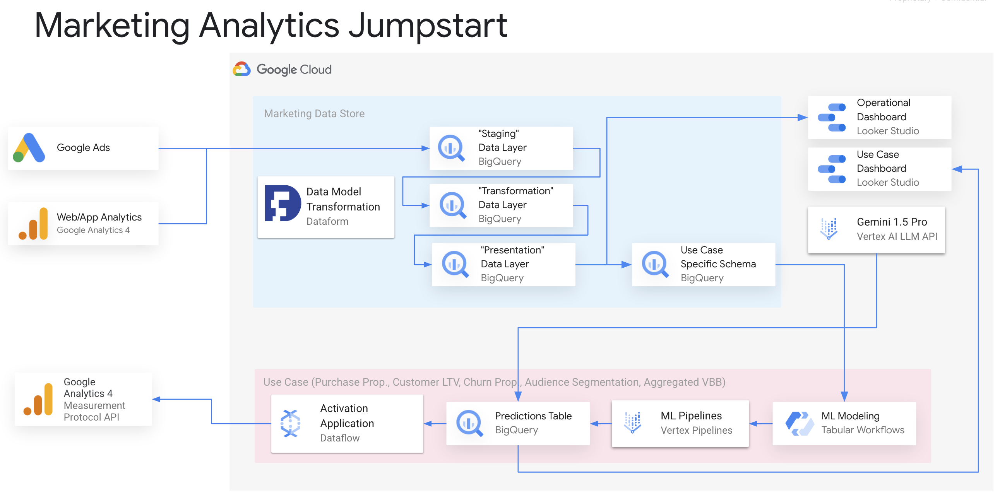
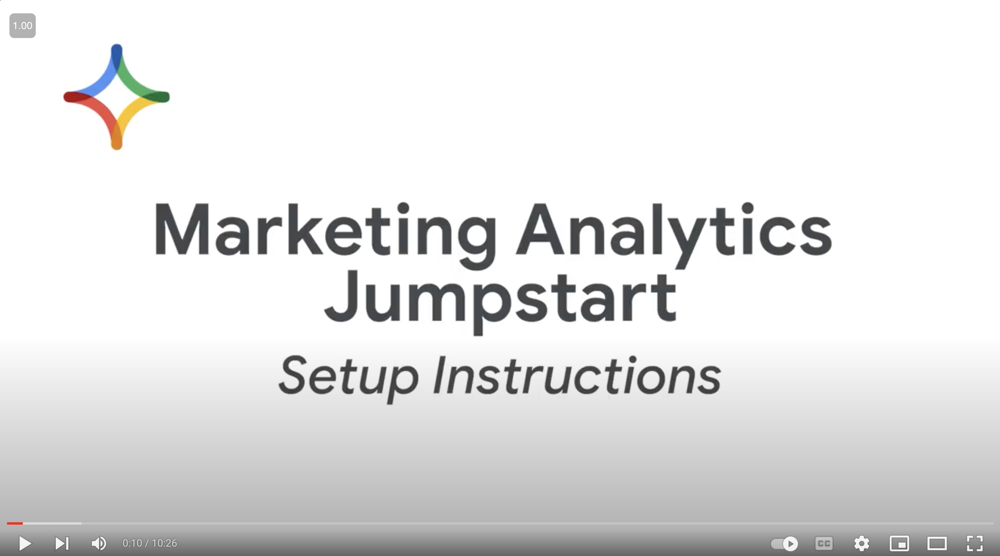

# Marketing Analytics Jumpstart
Marketing Analytics Jumpstart (MAJ) is a terraform automated, quick-to-deploy, customizable end-to-end marketing solution on Google Cloud Platform (GCP). This solution aims at helping customer better understand and better use their digital advertising budget.

Customers are looking to drive revenue and increase media efficiency be identifying, predicting and targeting valuable users through the use of machine learning. However, marketers first have to solve the challenge of having a number of disparate data sources that prevent them from having a holistic view of customers. Marketers also often don't have the expertise and/or resources in their marketing departments to train, run, and activate ML models on paid channels. Without this solution that enables innovation through predictive analytics, marketers are missing opportunities to advance their marketing program and accelerate key goals and objectives (e.g. acquire new customers, improve customer retention, etc).

## Version Variants

| Version Name | Branch | Purpose |
| ------------ | ------ | ------- |
| Multi Stream Activation | [multi-stream-activation](https://github.com/GoogleCloudPlatform/marketing-analytics-jumpstart/tree/multi-stream-activation) | Activate to multiple Google Analytics 4 data streams (websites and application). |
| Multi Property | [multi-property](https://github.com/GoogleCloudPlatform/marketing-analytics-jumpstart/tree/multi-property) | Deployment of multiple MAJ resources per each Google Analytics 4 property in the same Google Cloud project. |

## Quick Installation ⏰

Want to quickly install and use it? Run this [installation notebook 📔](https://colab.sandbox.google.com/github/GoogleCloudPlatform/marketing-analytics-jumpstart/blob/main/notebooks/quick_installation.ipynb) on Google Colaboratory and leverage Marketing Analytics Jumpstart in under 30 minutes.

If that was just too fast, continue reading this document to learn more in details.

## Benefits 🫴
After installing the solution users will get:
* Scheduled ETL jobs for an extensible logical data model based on the Google Analytics 4 (GA4) and Google Ads (GAds) daily exports
* Validated feature engineering SQL transformations from event-level data to user-level data for reporting and machine learning models training and prediction
* End-to-end ML pipelines for Purchase Propensity, Customer Lifetime Value, Audience Segmentation and Value Based Bidding
* Dashboard for interpreting the data, model predictions and monitoring the pipelines and jobs in a seamless manner
* Activation application that sends models prediction to GA4 via Measurement Protocol API

## Who can benefit from this solution? 🙇‍♀️
This solution is intended for Marketing Technologist teams using GA4 and GAds products. It facilitates efforts to store, transform, analyze marketing data, and programmatically creates audiences segments in Google Ads to support conversion optimization and remarketing campaigns.

| Role | User Journeys | Skillset | Can Deploy? |
|-------|-------------|----------|-------------|
| Marketing Scientist | Using an isolated and secure sandbox infrastructure to perform and monitor explorations with sensitive data. Using automated machine learning to accelerate time-to-value on building use cases solutions. Faster learning curve to quickly and easily access and analyze data from the marketing data store. Ability to collaborate with other teams by reusing similar components. | Vertex AI, Python, SQL, Data Science | No |
| Marketing Analyst | Simplifying the operation of the marketing data store (data assertions), machine learning pipelines (model training, prediction, explanation) and the activation application. Monitoring Ads Campaigns Performance, Web Traffic and Predictive Insights Reports. Interpreting the insights provided to plan and activate Ads campaigns. Defining audience segments using predictive metrics. | BigQuery, Looker Studio, Google Analytics 4, Google Ads | Yes |
 | Digital Marketing Manager | Gaining insights into customer behavior to improve marketing campaigns. Identifying and targeting new customers. Measuring the effectiveness of marketing campaigns. | Looker Studio, Google Analytics 4, Google Ads | No |
| IT/Data Engineer | Building and maintaining marketing data store transformation jobs. Developing and deploying custom marketing use cases reusing a consistent infrastructure. Integrating 1st party data and Google 3rd party data by extending the marketing data store. | Python, SQL, Google Cloud Platform, Data Engineering | Yes |

## Use Cases 🖱️
This solution enables customer to plan and take action on their marketing campaigns by interpreting the insights provided by these common predictive use cases and reports that informs Campaigns performance, Traffic, User Behavior and Models Predictions insights, using the best of Google Cloud Data and AI products.

These insights are used to serve as a basis to optimize paid media efforts and investments by:
* Building audience segments by using all Google first party data to identify user interests and demographic characteristics relevant to the campaign
* Improving campaign performance by identifying and targeting users deciles most likely to take an action (i.e. purchase, churn, etc)
* Driving a more personalized experience for your highly valued customers and improve return on ads spend (ROAS) via customer lifetime value
* Attributing bidding values to specific users according to their journeys through the conversion funnel which Ads platform uses to guide maximize conversions in specific markets

| Use Case | Data Sources | Model | Looker Report Name | Google Ads Campaign Optimization |
|-------|-------|-------|--------|--------|
| Audience Segmentation | Google Analytics 4 | BQML Kmeans | Demographic based Audience Segmentation | [Custom Data Segments](https://support.google.com/google-ads/answer/2497941?sjid=12303667953034547771-NC#zippy=%2Cyour-data-segments-formerly-known-as-remarketing) |
| Auto Audience Segmentation | Google Analytics 4 | BQML Kmeans | Interest based Audience Segmentation | [Custom Data Segments](https://support.google.com/google-ads/answer/2497941?sjid=12303667953034547771-NC#zippy=%2Cyour-data-segments-formerly-known-as-remarketing) |
| Customer Lifetime Value | Google Analytics 4 | Vertex AI Tabular Wokflows AutoML | Customer Lifetime Value | [Custom Data Segments](https://support.google.com/google-ads/answer/2497941?sjid=12303667953034547771-NC#zippy=%2Cyour-data-segments-formerly-known-as-remarketing)    Bid Adjustment (maximize conversions) [1](https://support.google.com/google-ads/answer/7068417?hl=en#zippy=%2Ctips-for-setting-up-data-segments-for-search-ads%2Csetting-bids-tailoring-ads-and-copying-campaigns) [2](https://support.google.com/google-ads/answer/2732132?sjid=8368074830549837931-NA#zippy=%2Cremarketing-lists-for-search-ads-advanced) |
| Purchase Propensity | Google Analytics 4 | Vertex AI Tabular Wokflows AutoML | Propensity to Purchase | [Custom Data Segments](https://support.google.com/google-ads/answer/2497941?sjid=12303667953034547771-NC#zippy=%2Cyour-data-segments-formerly-known-as-remarketing)    Bid Adjustment (maximize conversions) [1](https://support.google.com/google-ads/answer/7068417?hl=en#zippy=%2Ctips-for-setting-up-data-segments-for-search-ads%2Csetting-bids-tailoring-ads-and-copying-campaigns) [2](https://support.google.com/google-ads/answer/2732132?sjid=8368074830549837931-NA#zippy=%2Cremarketing-lists-for-search-ads-advanced) |
| Churn Propensity | Google Analytics 4 | Vertex AI Tabular Wokflows AutoML | Propensity to Churn | [Custom Data Segments](https://support.google.com/google-ads/answer/2497941?sjid=12303667953034547771-NC#zippy=%2Cyour-data-segments-formerly-known-as-remarketing) |
| Aggregated Value Based Bidding | Google Analytics 4 | Vertex AI Tabular Wokflows AutoML | High Value Action | [Static Conversion Values](https://support.google.com/google-ads/answer/13064107?sjid=13060303839552593837-NA#zippy=%2Cset-a-conversion-value%2Cchange-a-conversion-value) |

## Repository Structure 🏗️
The solution's source code is written in Terraform, Python, SQL, YAML and JSON; and it is organized into five main folders:
* `config/`: This folder contains the configuration file for the solution. This file define the parameters and settings used by the various components of the solution.
* `docs/`: This folder contains the detailed architecture, design principles, deployment, basic operation and troubleshooting guides for all the solution components
* `infrastructure/terraform/`: This folder contains the Terraform modules, variables and the installation guide to deploy the solution's infrastructure on GCP.
    * `infrastructure/terraform/modules/`: This folder contains the Terraform modules and their corresponding Terraform resources. These modules corresponds to the architectural components broken down in the next section.
* `notebooks/`: Contains python notebooks to be used in Workshop sessions.
* `python/`: This folder contains most of the Python code. This code implements the activation application, which sends model predictions to Google Analytics 4; and the custom Vertex AI pipelines, its components and the base component docker image used for feature engineering, training, prediction, and explanation pipelines. It also implements the cloud function that triggers the activation application, and the Google Analytics Admin SDK code that creates the custom dimensions on the GA4 property.
* `scripts/`: Miscelaneous scripts to support installation and operation of the solution.
* `sql/`: This folder contains the SQL code and table schemas specified in JSON files. This code implements the stored procedures used to transform and enrich the marketing data, as well as the queries used to invoke the stored procedures and retrieve the data for analysis.
* `templates/`: This folder contains the templates for generating the Google Analytics 4 Measurement Protocol API payloads used to send model predictions to Google Analytics 4.

In addition to that, there is a `tasks.py` file which implements python invoke tests who hydrate values to the JINJA template files with the `.sqlx` extension  located in the `sql/` folder that defines the DDL and DML statements for the BigQuery datasets, tables, procedures and queries.

## High Level Architecture 📋

The provided architecture diagram depicts the high-level architecture of the Marketing Analytics Jumpstart solution. Let's break down the components:

1. Data Sources:
* Google Analytics 4 Export: This provides daily data exports from your Google Analytics 4 property to BigQuery.
* Google Ads Export: This provides daily data exports from your Google Ads account to BigQuery.

2. Marketing Data Store:
* Dataform: This tool manages the data transformation and enrichment process. It uses SQL-like code to define data pipelines that transform the raw data from Google Analytics 4 and Google Ads into a unified and enriched format.

3. Feature Store:
* BigQuery: This serves as the central repository for storing the features extracted from the marketing data.
* Vertex AI Pipelines: These pipelines automate the feature engineering process, generating features based on user behavior, traffic sources, devices, and other relevant factors.

4. Machine Learning Pipelines:
* Vertex AI Pipelines: These pipelines handle the training, prediction, and explanation of various machine learning models.
* Tabular Workflow End-to-End AutoML: This approach automates the model training process for tasks like purchase propensity and customer lifetime value prediction.
* Custom Training and Prediction Pipelines: These pipelines are used for the auto audience segmentation training and prediction; and for the aggregated value based bidding model explanation.
* Gemini Insights: This leverages the Gemini 1.5 Vertex AI LLM API to provide insights on user behaviour and revenue. Gemini is connected directly to BigQuery and the insights are provided via a Looker Studio report.

5. Activation Application:
* Dataflow: This tool processes the model predictions and sends them to Google Analytics 4 via the Measurement Protocol API.
* User-level Predictions: These predictions are used to enhance your Google Analytics 4 data with insights about user behavior and purchase likelihood.

6. Dashboards:
* Looker Studio: This tool provides interactive dashboards for visualizing the performance of your Google Ads campaigns, user behavior in Google Analytics 4, LLM inisghts and the results of the machine learning models.

7. Monitoring:
* Dataform Jobs: These jobs are monitored for errors to ensure the data transformation process runs smoothly.
* Vertex AI Pipelines Runs: These runs are monitored to track the performance and success of the machine learning pipelines.

This high-level architecture demonstrates how Marketing Analytics Jumpstart integrates various Google Cloud services to provide a comprehensive solution for analyzing and activating your marketing data.

## Advantages 🔦
1. Easy to deploy: Deploy the resources and use cases that you need.
2. Cost Effective: Pay only for the cost of infrastructure in order to maintain the Data Store, Feature Store and ML Models.
3. Keep control of your data: This solution runs entirely in your environment and doesn’t transfer data out of your ownership or organization.
4. Fondation for 1st Party Data Strategy: The data store can serves as a basis for your team to customize or implement your own use cases and enable in house expertise to thrive.
5. Enable team collaboration: Use Terraform to maintain dependency graph between the resources and to manage resources lifecycle.

## Installation Pre-Requisites
- [ ] [Create GCP project](https://cloud.google.com/resource-manager/docs/creating-managing-projects#creating_a_project) and [Enable Billing](https://cloud.google.com/billing/docs/how-to/modify-project)
- [ ] Set up [Google Analyics 4 Export](https://support.google.com/analytics/answer/9823238?hl=en#zippy=%2Cin-this-article) and [Google Ads Export](https://cloud.google.com/bigquery/docs/google-ads-transfer) to Bigquery
- [ ] [Backfill](https://cloud.google.com/bigquery/docs/google-ads-transfer) BigQuery Data Transfer service for Google Ads
- [ ] Have existing Google Analytics 4 Property with [Measurement ID](https://support.google.com/analytics/answer/12270356?hl=en)

**Note:** Google Ads Customer Matching currently only works with Google Analytics 4 **Properties** linked to Google Ads Accounts, it won't work for subproperties or Rollup properties.

## Installation Permissions and Privileges
- [ ] Google Analytics Property Editor or Owner
- [ ] Google Ads Reader
- [ ] Project Owner* for a Google Cloud Project
- [ ] GitHub or GitLab account priviledges for repo creation and access token. [Details](https://cloud.google.com/dataform/docs/connect-repository)

**Note:** Project Owner for a Google Cloud Project is only required to speed up the deployment process. Consult this [guide]() for a more fine-grained permission list, not including the Owner role, to adhere to your company policies.

## Compute regions and data locations compatibility

This solution is compatible in all the regions as listed in these listings:

|  | Compute Regions |
|-------|-------|
https://cloud.google.com/compute/docs/regions-zones#available    https://cloud.google.com/vertex-ai/docs/general/locations    https://cloud.google.com/dataflow/docs/resources/locations | "asia-east1", "asia-east2", "asia-northeast1", "asia-northeast3", "asia-south1", "asia-southeast1", "asia-southeast2", "australia-southeast1", "europe-west1", "europe-west2", "europe-west3", "europe-west4", "europe-west6", "europe-west12", "me-central1", "me-central2", "northamerica-northeast1", "southamerica-east1", "us-central1", "us-east1", "us-east4", "us-east5", "us-south1", "us-west1", "us-west2", "us-west4" |

|  | Data Locations |
|-------|-------|
https://cloud.google.com/bigquery/docs/locations | "US", "EU", "asia-east1", "asia-east2", "asia-northeast1", "asia-northeast2", "asia-northeast3", "asia-south1", "asia-south2", "asia-southeast1", "asia-southeast2", "australia-southeast1",    "australia-southeast2", "europe-central2", "europe-north1", "europe-west1", "europe-west2", "europe-west3", "europe-west4", "europe-west6", "europe-west8", "europe-west9", "northamerica-northeast1", "northamerica-northeast2", "southamerica-east1", "southamerica-west1", "us-central1", "us-central2",    "us-east1", "us-east4", "us-west1", "us-west2", "us-west3", "us-west4" |

## Step by Step Installation 👷‍♀️

To facilitate the step by step installation process, we offer you two routes:

* One is a guided step by step installation with the help of Google Cloud Shell Tutorial.
* Another is to follow the step by step manual installation guide supported by a video recording.

To understand better which route is more appropriate for your needs, read this [documentation](./infrastructure/README.md). 

To follow the manual installation guide, open the Youtube video below on another tab and read the instructions on the [documentation](./infrastructure/README.md) above.

## Contributing 🤝
We welcome all feedback and contributions!  Please read [CONTRIBUTING.md](./CONTRIBUTING.md) for more information on how
to publish your contributions.

## License
This project is licensed under the [Apache License, Version 2.0](https://www.apache.org/licenses/LICENSE-2.0).

## Resources 📚
This a list of public websites you can use to learn more about the Google Analytics 4, Google Ads, Google Cloud Products we used to build this solution.

| Websites | Description |
|----------|-------------|
| [github.com/GoogleCloudPlatform/marketing-analytics-jumpstart-dataform](https://github.com/GoogleCloudPlatform/marketing-analytics-jumpstart-dataform) | Marketing Analytics Jumpstart Dataform GitHub Repository |
| [console.cloud.google.com/marketplace/product/bigquery-data-connectors/google_ads](https://console.cloud.google.com/marketplace/product/bigquery-data-connectors/google_ads) | BigQuery Data Transfer Service for Google Ads |
| [support.google.com/google-ads/*](https://support.google.com/google-ads/) [support.google.com/analytics/*](https://support.google.com/analytics/) | Google Ads and Google Analytics Support |
| [support.google.com/looker-studio/*](https://support.google.com/looker-studio/) | Looker Studio Support |
| [developers.google.com/analytics/*](https://developers.google.com/analytics/) [developers.google.com/google-ads/*](https://developers.google.com/analytics/) | Google Ads and Google Analytics Developers Guides |
| [cloud.google.com/developers/*](https://cloud.google.com/developers/) [developers.google.com/looker-studio/*](https://developers.google.com/looker-studio/) | Google Cloud & Looker Studio Developers Guides |
| [cloud.google.com/bigquery/docs/*](https://cloud.google.com/bigquery/docs/) [cloud.google.com/vertex-ai/docs/*](https://cloud.google.com/vertex-ai/docs/) [cloud.google.com/looker/docs/*](https://cloud.google.com/looker/docs/) [cloud.google.com/dataform/docs/*](https://cloud.google.com/dataform/docs/) | Google Cloud Product Documentation |
| [cloud.google.com/python/docs/reference/aiplatform/latest/*](https://cloud.google.com/python/docs/reference/aiplatform/latest/) [cloud.google.com/python/docs/reference/automl/latest/*](https://cloud.google.com/python/docs/reference/automl/latest/) [cloud.google.com/python/docs/reference/bigquery/latest/*](https://cloud.google.com/python/docs/reference/bigquery/latest/) | Google Cloud API References Documentation |

## Disclaimer
This is not an officially supported Google product.
This solution in a work in progress and currently in the preview stage.

