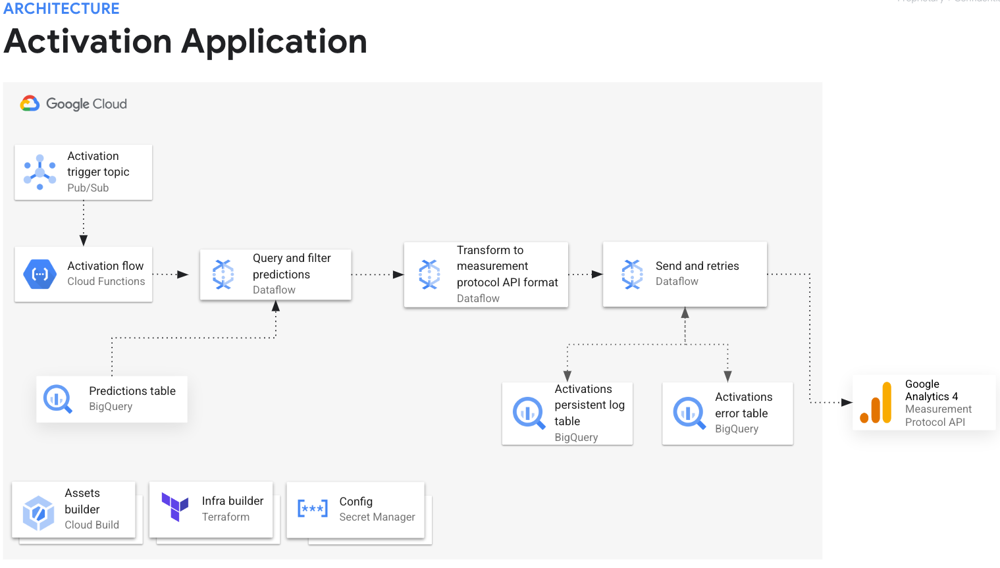
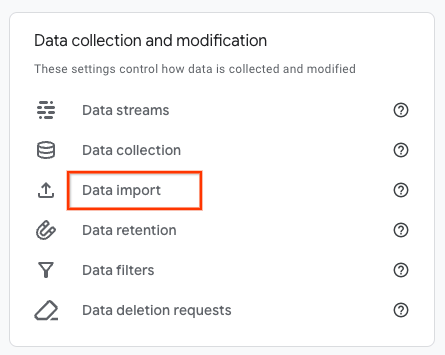
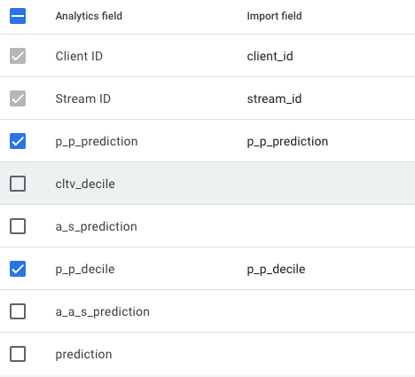
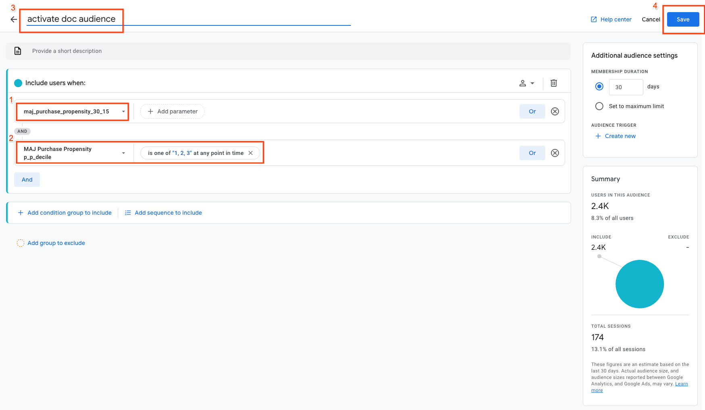

# Activation Process Guide
## Introduction

The activation process enriches your Google Analytics 4 (GA4) user profiles with custom properties based on machine learning predictions for the different use cases supported by MAJ. This enrichment enables granular audience segmentation for targeted remarketing campaigns.

The activation process is automated and built on Google Cloud Dataflow for efficient data processing and reliable data delivery into GA4.

This guide details how to monitor the activation process, leverage the enriched user data, and tailor the process to fit your specific requirements.
## Prerequisites
The present activation implementation is dependent on the connection between your Google Analytics property and your Google Ads account. For the users in the custom audiences you create in GA4 to be able to synchronize with Google Ads, you must have the following setting:
1. [Advanced settings to allow for ads personalization on your GA4 property](https://support.google.com/analytics/answer/9626162)
1. For audiences to be transmitted to Google Ads, Ads personalization must be [enabled on the link](https://support.google.com/analytics/answer/9626162#ads-link) between a Google Analytics property and a Google Ads link
1. [Consent Mode](https://support.google.com/analytics/answer/9976101) implemented

    If you implement a consent banner requesting permission to store ads or analytics data, users who visit your site or app can choose to opt out. If users opt out of ads data storage, they are ineligible for remarketing campaigns. However, if they have agreed to analytics storage, they may still appear in your Google Analytics 4 reports, but they will not be included in the count for any linked advertising services.
    - To verify that you have a user base of eligible users for remarketing, you can turn on [GA4 export to BigQuery of User-data](https://support.google.com/analytics/answer/12769371?hl=en).
    -   In the export table, look for eligible users that allow personalized ads by running the following query:
        ```sql
        SELECT pseudo_user_id, privacy_info.is_ads_personalization_allowed
        FROM `analytics_XXXXXXXXX.pseudonymous_users_*`
        WHERE privacy_info.is_ads_personalization_allowed = 'true';
        ```
To further comprehend the factors affecting the audience synchronization between GA4 and Google Ads, please refer to the following guide: [Audience size differences between Google Analytics and Google Ad](https://support.google.com/analytics/answer/13656908).

## Activation process overview

MAJ automatically creates the following custom events and user properties corresponding to each supported use case as part of the installation process:
| Use Case |	GA4 Custom Event | GA4 Custom User Properties |
| -------- | ------- | --------- |
| Purchase Propensity | `maj_purchase_propensity_30_15` |	`p_p_prediction`<br>`p_p_decile` |
| Customer Lifetime Value  | `maj_cltv_180_30` |	`cltv_decile` |
| Demographic Audience Segmentation | `maj_audience_segmentation_15` |	`a_s_prediction` |
| Interest based Audience Segmentation | `maj_auto_audience_segmentation_15` |	`a_a_s_prediction` |
| Churn Propensity | `maj_churn_propensity_30_15` |	`c_p_prediction`<br>`c_p_decile` |

For each use case, a corresponding SQL query template dictates how prediction values are selected and processed for activation:

| Use Case |	Query Template |
| -------- | --------- |
| Purchase Propensity | [purchase_propensity_query_template.sqlx](../templates/activation_query/purchase_propensity_query_template.sqlx)|
| Customer Lifetime Value  | [cltv_query_template.sqlx](../templates/activation_query/cltv_query_template.sqlx) |
| Demographic Audience Segmentation | [audience_segmentation_query_template.sqlx](../templates/activation_query/audience_segmentation_query_template.sqlx) |
| Interest based Audience Segmentation | [auto_audience_segmentation_query_template.sqlx](../templates/activation_query/auto_audience_segmentation_query_template.sqlx) |
| Churn Propensity | [churn_propensity_query_template.sqlx](../templates/activation_query/churn_propensity_query_template.sqlx)|

The [activation configuration](../templates/activation_type_configuration_template.tpl) file links the GA4 custom events with their corresponding query templates and [GA4 Measurement Protocol payload template](../templates/app_payload_template.jinja2)

The payload have the following keys set based on the [payload reference documentation](https://developers.google.com/analytics/devguides/collection/protocol/ga4/reference#payload_post_body):

| Key |	Value |
| -------- | --------- |
| `client_id` | `user_pseudo_id` from the last GA4 event |
| `user_id` | `user_id` from the last GA4 event and is only set if the field is not empty |
| `timestamp_micros` | 1 micro second before `event_timestamp` of the last GA4 event |
| `consent` | Allow sending user data from the request's events and user properties to Google for advertising purposes and personalized advertising for the user. |
| `user_properties` | [GA4 Custom User Properties](#activation-process-overview) specific for each use case |
| `event` | [GA4 Custom Event](#activation-process-overview) specific for each use case and `session_id` from the last GA4 event as [Event-scoped custom parameters](https://developers.google.com/analytics/devguides/collection/protocol/ga4/reference#custom_parameters) |

The activation pipeline reads the activation configuration to dynamically determine the templates to use for the specific use case it is processing.

Activation Pipeline Steps:
1. **Hydration:** Populates the prediction selection query template with the concrete use case prediction table. 
1. **Query Execution:** Runs the prediction selection query to retrieve all predictions that need activation. 
1. **Payload Generation:** Fills the GA4 Measurement Protocol payload template to create payloads for each prediction result.
1. **Event Transmission:** Sends each prediction as a custom event to GA4 using the [Measurement Protocl API](https://developers.google.com/analytics/devguides/collection/protocol/ga4/user-properties). 
1. **Logging:** Records each entry into an activation log table in BigQuery for tracking and auditing purposes.

### Prediction selection logic
The activation process links custom events sent to GA4 with the last user session. This is achieved by setting matching `session_id` and `event_timestamp` values in the payload.

Since the Measurement Protocol only accepts events within a 72-hour window, the activation process performs a cross join between the prediction results and the last 72 hours' user data. This ensures that only users active within this timeframe are selected for activation. 

### Activation process triggering
The activation Dataflow job is initiated by events sent to the Cloud Pub/Sub topic `activation-trigger`. The message format is as follows:
```
{"activation_type": "...","source_table": "..."}
```

Where:

* `activation_type`: A value corresponding to a key from the activation configuration file (e.g., "purchase-propensity-30-15").

* `source_table`: A reference to the actual BigQuery table containing prediction results (e.g., "purchase_propensity.predictions_2024_05_04T02_04_06_124Z_244_view").

For example:
```
{"activation_type": "purchase-propensity-30-15","source_table": "purchase_propensity.predictions_2024_05_04T02_04_06_124Z_244_view"}
```

By the end of the ML prediction process, a triggering event containing the path to the prediction table is sent to Pub/Sub, which automatically initiates the activation process on the prediction results.
You can also manually trigger the activation pipeline by sending the message through the [Pub/Sub console](https://console.cloud.google.com/cloudpubsub/topic/detail/activation-trigger?mods=logs_tg_staging&tab=messages&modal=publishmessage)

## Activating predictions on new models

The following changes will enable your system to send activation data (presumably related to a new model prediction) to Google Analytics 4 using Measurement Protocol and User Data Import. This is done through a Dataflow job, which is a way to process large datasets in a scalable and distributed manner. For the sake of this exercise, let's pretend we want to activate on a churn propensity model prediction.

**Modify Files:**
- `infrastructure/terraform/modules/activation/main.tf` (Terraform): New terraform resources are defined and the `activation_type_configuration` is updated.
  - New Data Object: Adds a new Terraform data object to load a template file called `churn_propensity_query_template_file`. This file likely contains a SQL query used to fetch data relevant to churn propensity from your feature store.
  - New Bucket Object: Creates a new object in your Google Cloud Storage bucket to hold the rendered version of the `churn_propensity_query_template_file`.
  - Configuration Update: Modifies the activation_type_configuration template to include the path to the newly created churn propensity query template in GCS. This ensures the Dataflow job can access the query.
- `python/ga4_setup/setup.py` (Python): 
  - New Custom Dimension: Creates new custom dimensions for the Churn Propensity use case. The new dimensions must match with the values keys being sent via Measurement Protocol. In this case, the GA4 Custom User Properties (c_p_prediction, c_p_decile).

**New Files:**
- `templates/activation_query/churn_propensity_query_template.sqlx` (Templated SQL): This query template aims to combine churn propensity predictions from {{source_table}} with user information from a table containing recent events. It calculates churn deciles, consolidates user IDs, and potentially adjusts event timestamps for consistency. The use of variables and placeholders makes it adaptable for different prediction sources and datasets.
- `templates/activation_user_import/churn_propensity_csv_export.sqlx` (Templated SQL): This script takes churn propensity predictions from a BigQuery table, prepares a temporary table with specific columns and calculations, and then exports this data to a CSV file in a GCS bucket. The use of dynamic SQL allows for flexibility in specifying the source prediction table.

**Note:** There is no need to modify the Dataflow job to use the new queries and send activation data to Google Analytics 4.

## Activation using User Data Import
GA4 [user-data import](https://support.google.com/analytics/answer/10071143?hl=en) is a file based batch import manually initiated through the GA4 console. Do the following steps for the user-data import.

- Export the prediction data by calling a stored procedure. For each of the use cases the corresponde procedure call are listed in the following table:

| Use Case |	Procedure Call |
| -------- | ------- |
| Purchase Propensity | ``CALL `activation.export_purchase_propensity_predictions`('purchase_propensity.predictions_2024_05_30T02_03_10_419Z_751_view');`` |
| Customer Lifetime Value  | ``CALL `activation.export_cltv_predictions`('customer_lifetime_value.predictions_2024_05_30T03_02_07_517Z_917_view_final');`` |
| Demographic Audience Segmentation | ``CALL `activation.export_audience_segmentation_predictions`('audience_segmentation.pred_audience_segmentation_inference_15_1717066870_view');`` |
| Interest based Audience Segmentation | ``CALL `activation.export_auto_audience_segmentation_predictions`('auto_audience_segmentation.predictions_2024_05_30T04_02_47_517Z_877');`` |

**Note:** replace the table name in the sample code with the actual prediction table name in your environment.

- Navigate to the `csv-export` folder within your `activation-app` bucket in Google Cloud Storage. Download the CSV file from previous step. The files are named according to the following pattern:

| Use Case |	Export file name |
| -------- | ------- |
| Purchase Propensity | `csv-export/purchase_propensity-000000000000.csv` |
| Customer Lifetime Value  | `csv-export/cltv-000000000000.csv` |
| Demographic Audience Segmentation | `csv-export/audience_segmentation-000000000000.csv` |
| Interest based Audience Segmentation | `csv-export/auto_audience_segmentation-000000000000.csv` |

**Note:** If you have a large number of users in the prediction tables the csv file export can output multiple files with incremental file suffix attached to the use case based file name. In that case you need to download all the files.

- Import the data from GA4 console
1. In GA4 Admin console choose **Data Import**

  

2. Choose **Create data source** and select **Data type** `User data by Client ID`

3. Give the data source a descriptive name.

4. Choose **Manual CSV upload** and **Upload CSV**

5. Select the export file you downloaded from GCS bucket in the previous step, choose **Next**

6. Map out the field based on the Use Case you currently loading predictions for. The following is a sample for the purchase propensity mapping.



7. Choose **Import**

## Build custom audiences in GA4
**Note:**  It can take up to 24 hours after sending data through the Measurement Protocol before the activation user data becomes available in GA4.

To build your custom audience, follow the [Create an audience guide](https://support.google.com/analytics/answer/9267572?#create-an-audience) to navigate to the "Build new audience" view and select **Create a custom audience** option. 

1. Choose the relevant custom event you want to target (e.g., `maj_purchase_propensity_30_15`)
1. Further refine your audience by selecting the custom user property that matches the use case (e.g., `MAJ Purchase Propensity p_p_decile`) and choose the specific user property values to include. **Note:** Decile values are in descending order, with the first decile (value: `1`) containing users with the highest propensity or lifetime value.
1. Give your audience a clear and descriptive name.
1. Click the save button to create the custom audience.

Now you have a custom audience that is automatically updated as new activation events are sent by the activation process. This custom audience can then be used for targeted remarketing campaigns in Google Ads or other platforms. Follow the [Share audiences guide](https://support.google.com/analytics/answer/12800258) to learn how to export your audience for use in external platforms.

**Important:** If you are using User Data Import only use the customer user properties and remove the custom event filtering. 

## Monitoring & Troubleshooting
The activation process logs all sent Measurement Protocol messages in log tables within the `activation` dataset in BigQuery. This includes both successful and failed transmissions, allowing you to track the progress of the activation, get number of events sent to GA4 and identify any potential issues.

### Cloud Resources Used in Activation
The following Cloud resources facilitate the activation flow. Use the links to access each resource's console page, verify its operational status, and troubleshoot any issues using the resource logs.
| Resource |	Description | Link |
| -------- | ------- | --------- |
| Pub/Sub Topic | Topic where activation events are sent to trigger the activation process. | [activation-trigger](https://console.cloud.google.com/cloudpubsub/topic/detail/activation-trigger) |
| Cloud Functions | Function that listens to the activation topic and orchestrates the activation Dataflow process. | [activation-function](https://console.cloud.google.com/functions/details/us-central1/activation-trigger) |
| Dataflow Job | The actual activation process runs here. | [activation-jobs](https://console.cloud.google.com/dataflow/jobs) |
|BigQuery| Stores activation logs. | [activation-dataset](https://console.cloud.google.com/bigquery?ws=!1m4!1m3!3m2!1sPROJECT!2sactivation) **Note:** replace the `PROJECT` placeholder in the link with your Google Cloud project ID |
| Cloud Storage | Stores all configuration files and templates. | [activation-files](https://console.cloud.google.com/storage/browser/activation-app-PROJECT) **Note:** replace the `PROJECT` placeholder in the link with your Google Cloud project ID |

### Monitoring Activation Runs
To monitor and troubleshoot specific activation runs, use the [Dataflow Cloud console](https://console.cloud.google.com/dataflow/jobs). Here, you can:

* **Check Run Status:** View the overall status of each activation run, including whether it is currently running, succeeded, or failed.
* **Inspect Step Details:** Drill down into individual steps within the activation processing pipeline to see their progress and identify any errors.
* **Access Logs:** View detailed logs for each activation run to pinpoint the exact cause of any issues and troubleshoot them effectively.

## Analyze Prediction Results
Learn how to leverage the MAJ dashboard to gain a[ comprehensive understanding of your prediction results](prediction_result_analysis.md).
