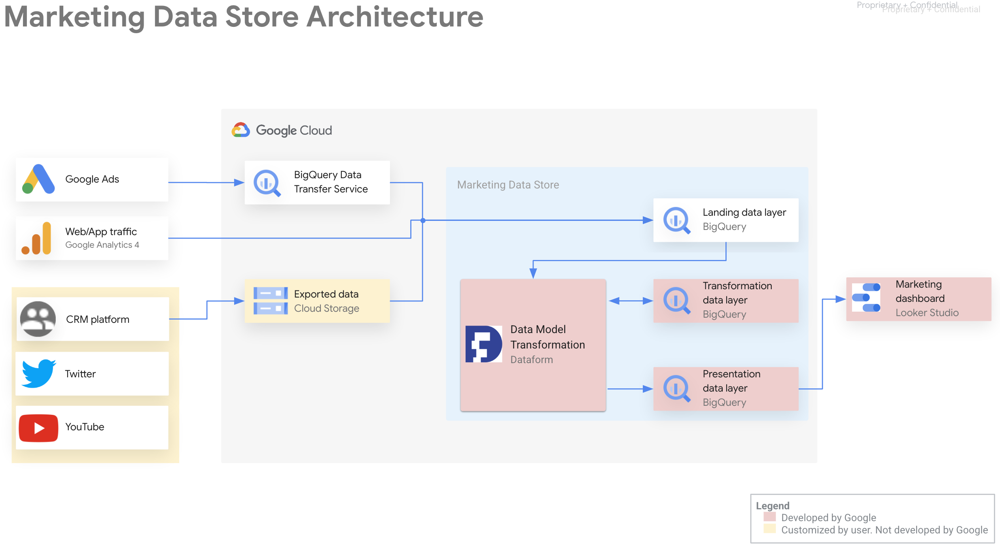
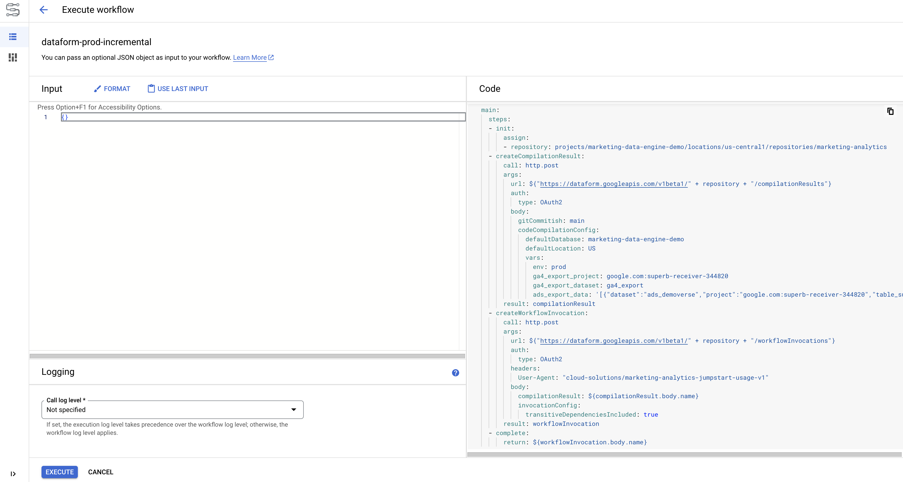

# Marketing Data Store (MDS) Guide

## Introduction

The Marketing Data Store efficiently process data, stores and analyzes the marketing data from Google Ads and Google Analytics 4. The Data Store implements the Marketing Data Warehouse Ads Performance and Digital Analytics domains. The Ads Performance domain prepares dimensions and metrics to understand the performance of advertisements on Paid Media channels. The Digital Analytics domain prepares dimensions and metrics to understand the user behaviour and conversion actions on the customer website and mobile app.

The Marketing Data Warehouse domains are implemented using BigQuery Dataform and are automated by Cloud Workflows. The incremental process is scheduled and triggered using Cloud Scheduler.

This guide details how to monitor the data store, leverage the enriched user data, and customize the data store to meet your specific requirements.

## Solution Architecture

This architecture diagram describes the end-to-end flow of data in the Marketing Data Store component, from ingestion through to consumption by dashboards. The core components are:
* **Data Sources**: Google Ads, Google Analytics 4, CRM, Social Media are staged in the landing data layer inside the Marketing Data Store. 
    * For Google Ads, a BigQuery Data Transfer Service is previously configured by the customer to export Ads Performance data to BigQuery. 
    * For Google Analytics 4, a Google Analytics 4 BigQuery Export is previously configured by the customer to export Google Analytics 4 data to BigQuery.
    * For CRM and Social Media platforms, use a data transfer service or product to export data to BigQuery. Once the data is in BigQuery, you can declare that BigQuery table as a Dataform data source, so that it lets you reference this data source in new Dataform table definitions and SQL operations.
* **Landing Layer**: The initial set of Dataform data sources, tables, views and incremental tables that will be used by Dataform to resolve changes in the data and recurrent incremental rows.
* **Transformation Layer**: The Dataform Definitions implemented in SQLX and JavaScript files that define new tables, incremental tables, views, and additional SQL operations to run in BigQuery. These definitions files creates the fact and dimensions table for each domain.
* **Presentation Layer**:The Dataform Definitions implemented in SQLX and Javascript files that define new views to be created in BigQuery. The definitions files are the final destination of all dependencies graphs across the definitions files in the transformation layer. The Presentation Layer contains BigQuery views which are ready to be consumed by the dashboards and the feature engineering pipelines.

## Who is this solution for?

We heard common stories from customers who were struggling with two frequent objectives:

1. **Cloud greenfield marketers without engineering resources to deploy data and processing systems**.

        Marketing data is siloed across a large number of different applications. An average marketers need to log in to 12-18 different user interfaces to do their job. They want to bring the data from these systems into BigQuery to gain a holistic understand of their marketing performance and strategy. Infrastructure development was technically challenging with unclear user benefits. We want to solve their deployment challenges by providing an easy-to-deploy robust infrastructure while making the underlying data easier to analyze through our logical data model to get a quicker time to value. 

2. **Marketers leveraging Marketing Analytics models without a consolidated logical data model**. 
        
        Commonly, it was recommended to bend the model to meet your data structure and multiple copies of data were being used by different marketing analytics models and system. That did not scale well in terms of governance, maintenance and costs. MDW's logical data model will allow us to build ML models against a consistent data structure requiring little-to-no modification for each customer. This will expedite deployment time and provide a quicker time to value.

## Benefits of the solution

After deploying the Marketing Data Store, Marketing Technology teams get the following benefits:

1. Understand and apply core data warehousing principles.
2. Ingest data from Google Marketing data sources via built-in BQ data integrations
3. Build their own BQ data integrations for 3rd party APIs via Dataflow templates 
4. Build their own BQ data integrations for 1st party data sources regardless of API availability via BQ 5. data ingestion
6. Gain operational efficiency and marketing insights through a holistic repository of their Marketing Organizations data

## Advantages of the solution

In comparison to other approaches, MDS solution offers the following advantages:

* Solve customer deployment challenges by providing an easy-to-deploy cloud infrastructure centered around BigQuery while making the underlying data easier to analyze through the logical data model to get a quicker time to value. The Marketing Data Store is focused on enabling marketers looking into implement Marketing Analytics to: 
    * Get a holistic understanding of marketing across the Paid-media and Digital Analytics teams
    * Democratize data discovery and use of consistent ang governed data and model
    * Start customer conversations on activating marketing campaigns leveraging programatically activation of models predictions to accomplish marketing objectives
* Marketing Data Store expedites deployment time and provide a quicker time to value for more sophisticated production-level predictive and generative ai modelling by establishing a common data foundation in place that enables reuse of data and features built on top of it to solve marketing challenges and accomplish marketing objectives.

## Data Store Views used by each Use Case

MAJ automatically creates the following custom events and user properties corresponding to each supported use case as part of the installation process:

| Use Case |	Feature Store Procedure | MDS Views |
| -------- | ------- | --------- |
| Purchase Propensity | `maj_purchase_propensity_30_15` |	`p_p_prediction` `p_p_decile` |
| Customer Lifetime Value  | `maj_cltv_180_30` |	`cltv_decile` |
| Demographic Audience Segmentation | `maj_audience_segmentation_15` |	`a_s_prediction` |
| Interest based Audience Segmentation | `maj_auto_audience_segmentation_15` |	`a_a_s_prediction` |
| Aggregated Value Based Bidding | `maj_purchase_propensity_30_15` |	`p_p_prediction` `p_p_decile` |

## Marketing Data Store Design Principles

1. MA Use-Cases compatible. 
At a minimum, the data model must include the appropriate data to deploy the existing Marketing Analytics use-cases. 

2. We are designing for the average marketer... 
We will not attempt to include all data an organization will have or should have available. We will focus on the most common datasets based on our conversations with customers. For technical skillset, we can assume intermediate SQL and beginner programming knowledge. We cannot assume data science knowledge.

3. ... but can be extended for the advanced marketer. 
The data model should be extendible so that it can be customized to the marketer's unique business needs and include other datasources or use-cases that are not in our scope. Teams with an advanced technical skillset will find the solution valuable as a foundation to build on top of. 

4. Data source agnostic. 
The data model should not be Google-centric, and, where possible, be consistent with other Marketing Platforms and products. (Example: Our advertising performance data model, should work with not just Google Ads, but Facebook Ads, Tiktok Ads, Bing Ads, etc.)

5. Product Sales-centric. 
Every type of business (Lead Gen, CPG, M&E, Public Sector, etc.) will dictate a variation of the data model. For the first version of the data model, we will focus on a product sales-centric (both ecommerce and brick and mortar) business as that is the vast majority of requests (Kraft, Grammarly, SHI, Mondelez, Diligent, Okta).

6. Strictly Star Schema. 
While the solution will leverage BigQuery, this data model design document will not address any BQ-centric optimization. This optimization may occur in the Execution phase. We remove that constraint to simplify our discussions in this document on the data model.

7. Keep Identity Spaces Separate 
Per Legal's guidance, Google is not allowed to provide guidance or assistance on stitching together user identity across identity spaces. That guidance and work should be deferred to partners. However, per Design Principle 3, we should not prohibit that from being built.  The Marketing Analytics team is of the opinion that identity stitching is best deferred to a partner-driven "Customer Data Platform" conversation. 

8. Follows Data Warehouse best practices. 
Data model is architected based on industry best practices for Data Warehousing. 
(The Data Warehouse Toolkit, ed. 3, Kimball, Ross)

## Manually Triggering Data Store Workflow

## Customize Google Analytics 4 Transformations
**Note:**  It can take up to 24 hours after sending data through the Measurement Protocol before the activation user data becomes available in GA4.

To build your custom audience, follow the [Create an audience guide](https://support.google.com/analytics/answer/9267572?#create-an-audience) to navigate to the "Build new audience" view and select **Create a custom audience** option. 

1. Choose the relevant custom event you want to target (e.g., `maj_purchase_propensity_30_15`)
1. Further refine your audience by selecting the custom user property that matches the use case (e.g., `MAJ Purchase Propensity p_p_decile`) and choose the specific user property values to include. **Note:** Decile values are in descending order, with the first decile (value: `1`) containing users with the highest propensity or lifetime value.
1. Give your audience a clear and descriptive name.
1. Click the save button to create the custom audience.

Now you have a custom audience that is automatically updated as new activation events are sent by the activation process. This custom audience can then be used for targeted remarketing campaigns in Google Ads or other platforms. Follow the [Share audiences guide](https://support.google.com/analytics/answer/12800258) to learn how to export your audience for use in external platforms.

## Customize Google Ads Transformations

## Implement new Google Analytics 4 and Google Ads transformations

## Migrating custom GA4 and Google Ads BigQuery SQL transformations to Dataform SQLX and JavaScript

## Importing custom data sources to Marketing Data Store

## Monitoring & Troubleshooting
The activation process logs all sent Measurement Protocol messages in log tables within the `activation` dataset in BigQuery. This includes both successful and failed transmissions, allowing you to track the progress of the activation, get number of events sent to GA4 and identify any potential issues.

### Monitoring Dataform Executions
To monitor and troubleshoot specific activation runs, use the [Dataflow Cloud console](https://console.cloud.google.com/dataflow/jobs). Here, you can:

* **Check Run Status:** View the overall status of each activation run, including whether it is currently running, succeeded, or failed.
* **Inspect Step Details:** Drill down into individual steps within the activation processing pipeline to see their progress and identify any errors.
* **Access Logs:** View detailed logs for each activation run to pinpoint the exact cause of any issues and troubleshoot them effectively.

## Review Dataform Executions and BigQuery Assets Created
Learn how to leverage the MAJ dashboard to gain a[ comprehensive understanding of your prediction results](prediction_result_analysis.md).
