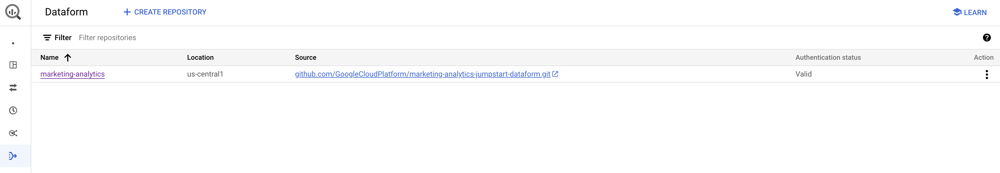
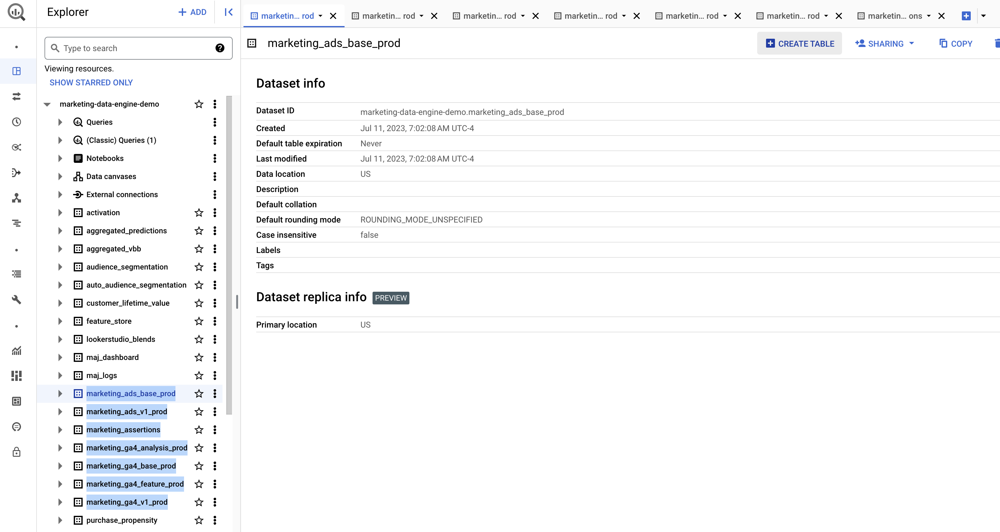
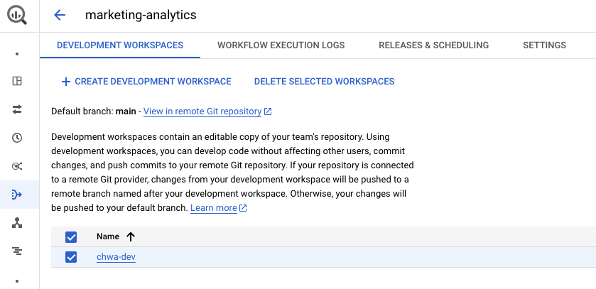
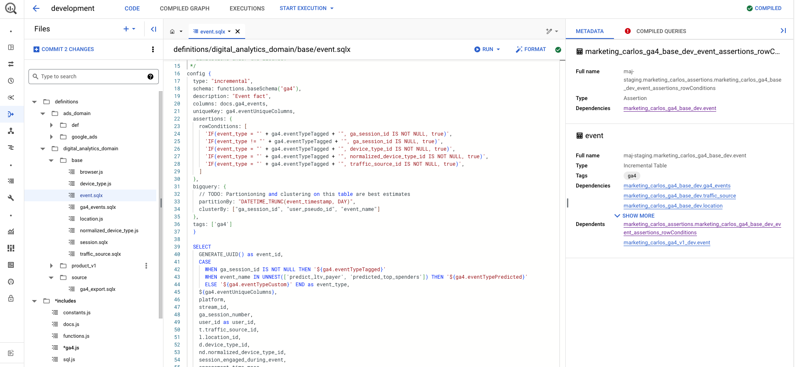
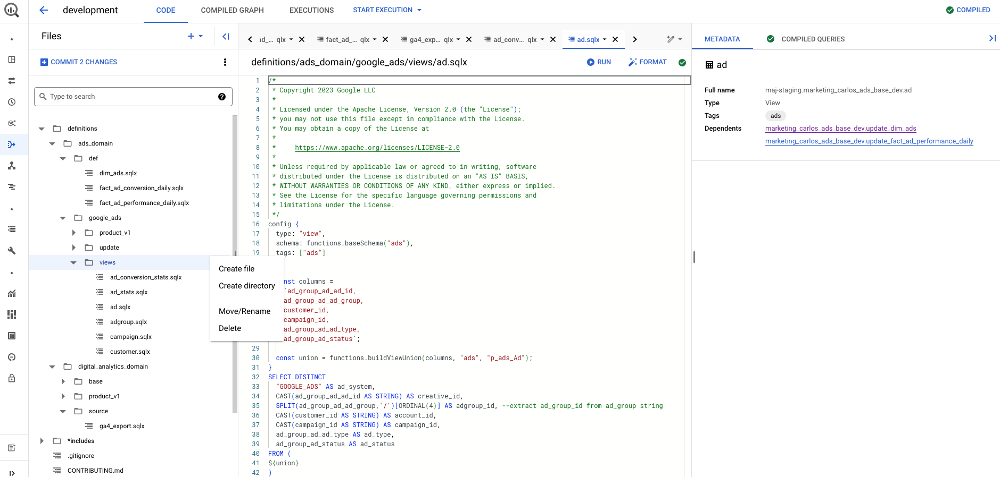
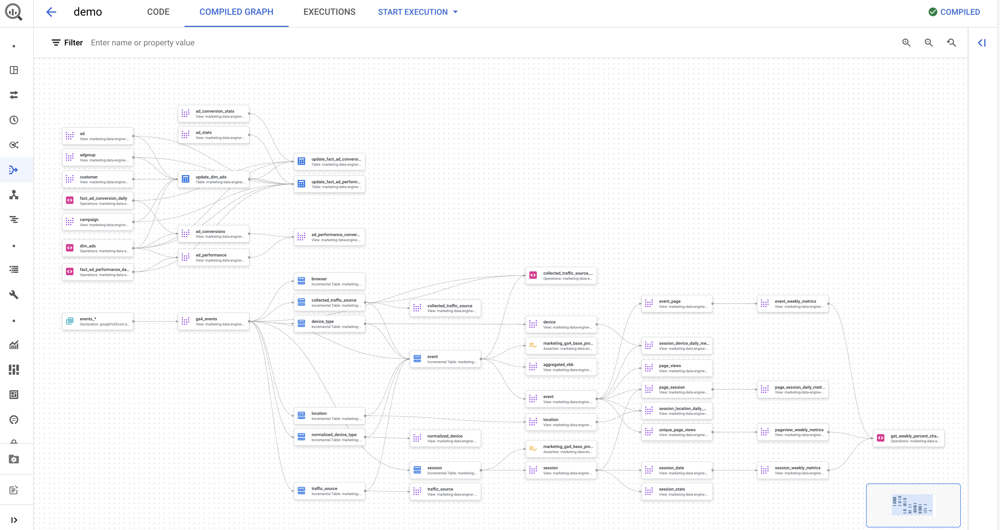
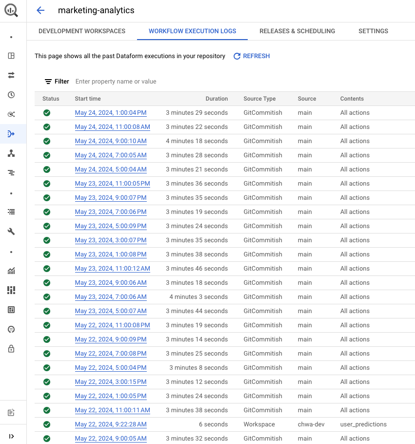
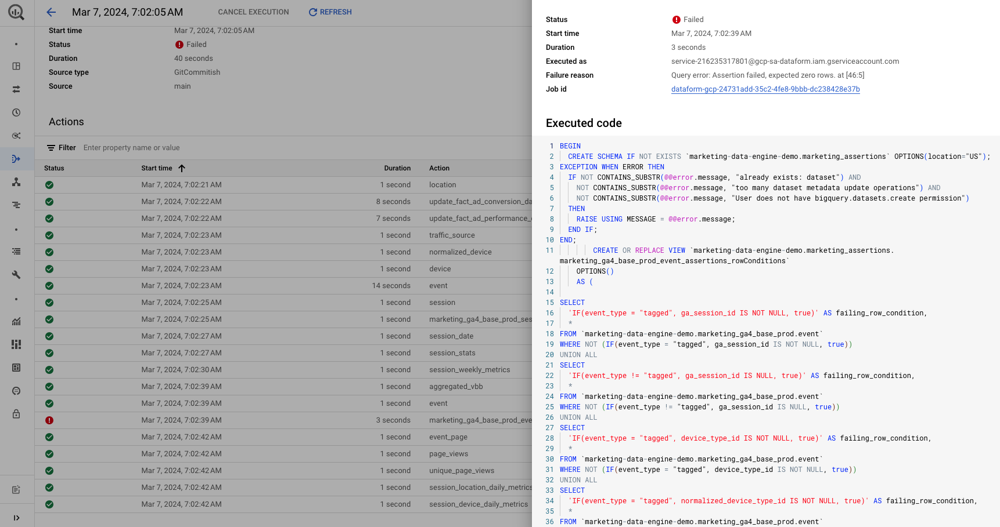

# Marketing Data Store (MDS) Guide

## Introduction

The Marketing Data Store efficiently process data, stores and analyzes the marketing data from Google Ads and Google Analytics 4. The Data Store implements the Marketing Data Warehouse Ads Performance and Digital Analytics domains. The Ads Performance domain prepares dimensions and metrics to understand the performance of advertisements on Paid Media channels. The Digital Analytics domain prepares dimensions and metrics to understand the user behaviour and conversion actions on the customer website and mobile app.

The Marketing Data Warehouse domains are implemented using BigQuery [Dataform](https://cloud.google.com/dataform/docs/overview) and are orchestrated using Cloud [Workflows](https://cloud.google.com/workflows/docs/overview). The incremental process is scheduled and triggered using Cloud [Scheduler](https://cloud.google.com/scheduler/docs/overview?hl=en).

This guide details how to deploy and monitor the data store, leverage the enriched user data, troubleashoot and customize the data store to meet your specific requirements.


## Solution Architecture


This architecture diagram describes the end-to-end flow of data in the Marketing Data Store component, from ingestion through to consumption by dashboards. The core components are:
* **Data Sources**: Google Ads, Google Analytics 4, CRM, Social Media are staged in the landing data layer inside the Marketing Data Store. 
    * For Google Ads, a [BigQuery Data Transfer Service](https://cloud.google.com/bigquery/docs/google-ads-transfer?hl=en) is previously configured by the customer to export Ads Performance data to BigQuery. 
    * For Google Analytics 4, a [Google Analytics 4 BigQuery Export](https://support.google.com/analytics/answer/9358801?hl=en) is previously configured by the customer to export Google Analytics 4 data to BigQuery.
    * For CRM ([Salesforce](https://cloud.google.com/bigquery/docs/salesforce-transfer?hl=en)) and Social Media platforms, use a data transfer service or product to export data to BigQuery. Once the data is in BigQuery, you can declare that BigQuery table as a Dataform data source, so that it lets you reference this data source in new Dataform table definitions and SQL operations.
* **Landing Layer**: The initial set of Dataform data sources, tables, views and incremental tables that will be used by Dataform to resolve changes in the data and recurrent incremental rows.
* **Transformation Layer**: The Dataform Definitions implemented in SQLX and JavaScript files that define new tables, incremental tables, views, and additional SQL operations to run in BigQuery. These definitions files creates the fact and dimensions table for each domain.
* **Presentation Layer**:The Dataform Definitions implemented in SQLX and Javascript files that define new views to be created in BigQuery. The definitions files are the final destination of all dependencies graphs across the definitions files in the transformation layer. The Presentation Layer contains BigQuery views which are ready to be consumed by the dashboards and the feature engineering pipelines.

## Who is this solution for?

We heard common stories from customers who were struggling with two frequent objectives:

1. **Cloud greenfield marketers without engineering resources to deploy data and processing systems**.
    - These marketers are new to the cloud and lack the technical expertise to deploy data and processing systems.
    - They need a solution that is easy to deploy and manage, and that provides a holistic view of their marketing data.
    - The Marketing Data Store provides a pre-built infrastructure that can be easily deployed and used to analyze marketing data.

2. **Marketers looking into leverage marketing analytics models without a consolidated logical data model**.     
    - These marketers are already using Marketing Analytics models, but they are struggling with the lack of a consistent data model.
    - This can lead to problems with data quality, governance, and maintenance.
    - The Marketing Data Store provides a logical data model that can be used to build and deploy Marketing Analytics models. This can help to improve data quality, governance, and maintenance.

## Benefits of the solution

After deploying the Marketing Data Store, Marketing Technology teams get the following benefits:

1. Understand and apply core data warehousing principles.
2. Ingest data from Google Marketing data sources via built-in BigQuery data integrations
3. Build their own BQ data integrations for 3rd party APIs via Dataflow templates 
4. Build their own BQ data integrations for 1st party data sources regardless of API availability via BQ 5. data ingestion
5. Gain operational efficiency and marketing insights through a holistic repository of their Marketing Organizations data


## Advantages of the solution

In comparison to other approaches, MDS solution offers the following advantages:

* Solve customer deployment challenges by providing an easy-to-deploy cloud infrastructure centered around BigQuery while making the underlying data easier to analyze through the logical data model to get a quicker time to value. The Marketing Data Store is focused on enabling marketers looking into implement Marketing Analytics to: 
    * Get a holistic understanding of marketing across the Paid-media and Digital Analytics teams
    * Democratize data discovery and use of consistent ang governed data and model
    * Start customer conversations on activating marketing campaigns leveraging programatically activation of models predictions to accomplish marketing objectives
* Marketing Data Store expedites deployment time and provide a quicker time to value for more sophisticated production-level predictive and generative ai modelling by establishing a common data foundation in place that enables reuse of data and features built on top of it to solve marketing challenges and accomplish marketing objectives.


## Data Store Views used by each Use Case

The Data Store Views already implemented and used by each Use Case are listed below:

| Use Case |	Feature Store Procedure | MDS Views |
| -------- | ------- | ---- |
| Purchase Propensity | [purchase_propensity_label](../sql/procedure/purchase_propensity_label.sqlx) <br> [user_dimensions](../sql/procedure/user_dimensions.sqlx) <br> [user_rolling_window_metrics](../sql/procedure/user_rolling_window_metrics.sqlx) <br> [user_scoped_metrics](../sql/procedure/user_scoped_metrics.sqlx) <br> [user_session_event_aggregated_metrics](../sql/procedure/user_session_event_aggregated_metrics.sqlx) |	[event](https://github.com/GoogleCloudPlatform/marketing-analytics-jumpstart-dataform/blob/main/definitions/digital_analytics_domain/product_v1/event.sqlx) <br> [device](https://github.com/GoogleCloudPlatform/marketing-analytics-jumpstart-dataform/blob/main/definitions/digital_analytics_domain/product_v1/device.sqlx) <br> [traffic_source](https://github.com/GoogleCloudPlatform/marketing-analytics-jumpstart-dataform/blob/main/definitions/digital_analytics_domain/product_v1/traffic_source.sqlx) <br> [location](https://github.com/GoogleCloudPlatform/marketing-analytics-jumpstart-dataform/blob/main/definitions/digital_analytics_domain/product_v1/location.sqlx) |
| Churn Propensity | [churn_propensity_label](../sql/procedure/churn_propensity_label.sqlx) <br> [user_dimensions](../sql/procedure/user_dimensions.sqlx) <br> [user_rolling_window_metrics](../sql/procedure/user_rolling_window_metrics.sqlx) <br> [user_scoped_metrics](../sql/procedure/user_scoped_metrics.sqlx) <br> [user_session_event_aggregated_metrics](../sql/procedure/user_session_event_aggregated_metrics.sqlx) |	[event](https://github.com/GoogleCloudPlatform/marketing-analytics-jumpstart-dataform/blob/main/definitions/digital_analytics_domain/product_v1/event.sqlx) <br> [device](https://github.com/GoogleCloudPlatform/marketing-analytics-jumpstart-dataform/blob/main/definitions/digital_analytics_domain/product_v1/device.sqlx) <br> [traffic_source](https://github.com/GoogleCloudPlatform/marketing-analytics-jumpstart-dataform/blob/main/definitions/digital_analytics_domain/product_v1/traffic_source.sqlx) <br> [location](https://github.com/GoogleCloudPlatform/marketing-analytics-jumpstart-dataform/blob/main/definitions/digital_analytics_domain/product_v1/location.sqlx) |
| Customer Lifetime Value  | [customer_lifetime_value_label](../sql/procedure/customer_lifetime_value_label.sqlx) <br> [user_lifetime_dimensions](../sql/procedure/user_lifetime_dimensions.sqlx) <br> [user_rolling_window_lifetime_metrics](../sql/procedure/user_rolling_window_lifetime_metrics.sqlx) <br> [user_scoped_lifetime_metrics](../sql/procedure/user_scoped_lifetime_metrics.sqlx) |	[event](https://github.com/GoogleCloudPlatform/marketing-analytics-jumpstart-dataform/blob/main/definitions/digital_analytics_domain/product_v1/event.sqlx) <br> [device](https://github.com/GoogleCloudPlatform/marketing-analytics-jumpstart-dataform/blob/main/definitions/digital_analytics_domain/product_v1/device.sqlx) <br> [traffic_source](https://github.com/GoogleCloudPlatform/marketing-analytics-jumpstart-dataform/blob/main/definitions/digital_analytics_domain/product_v1/traffic_source.sqlx) <br> [location](https://github.com/GoogleCloudPlatform/marketing-analytics-jumpstart-dataform/blob/main/definitions/digital_analytics_domain/product_v1/location.sqlx) |
| Demographic Audience Segmentation | [user_segmentation_dimensions](../sql/procedure/user_segmentation_dimensions.sqlx) <br> [user_lookback_metrics](../sql/procedure/user_lookback_metrics.sqlx) <br> [user_scoped_segmentation_metrics](../sql/procedure/user_scoped_segmentation_metrics.sqlx) |	[event](https://github.com/GoogleCloudPlatform/marketing-analytics-jumpstart-dataform/blob/main/definitions/digital_analytics_domain/product_v1/event.sqlx) <br> [device](https://github.com/GoogleCloudPlatform/marketing-analytics-jumpstart-dataform/blob/main/definitions/digital_analytics_domain/product_v1/device.sqlx) <br> [traffic_source](https://github.com/GoogleCloudPlatform/marketing-analytics-jumpstart-dataform/blob/main/definitions/digital_analytics_domain/product_v1/traffic_source.sqlx) <br> [location](https://github.com/GoogleCloudPlatform/marketing-analytics-jumpstart-dataform/blob/main/definitions/digital_analytics_domain/product_v1/location.sqlx) |
| Interest based Audience Segmentation | [auto_audience_segmentation_dataset_preparation](../python/pipelines/components/bigquery/component.py) |	[event](https://github.com/GoogleCloudPlatform/marketing-analytics-jumpstart-dataform/blob/main/definitions/digital_analytics_domain/product_v1/event.sqlx) |
| Aggregated Value Based Bidding | - | [aggregated_vbb](https://github.com/GoogleCloudPlatform/marketing-analytics-jumpstart-dataform/blob/main/definitions/digital_analytics_domain/product_v1/aggregated_vbb.sqlx) |


## Marketing Data Store Design Principles

When building the Marketing Data Store, the following principles are considered:

1. **MA Use-Cases compatible.**
At a minimum, the data model must include the appropriate data to deploy the existing Marketing Analytics use-cases. 

2. **We are designing for the average marketer...** 
We will not attempt to include all data an organization will have or should have available. We will focus on the most common datasets based on our conversations with customers. For technical skillset, we can assume intermediate SQL and beginner programming knowledge. We cannot assume data science knowledge.

3. **... but can be extended for the advanced marketer.** 
The data model should be extendible so that it can be customized to the marketer's unique business needs and include other datasources or use-cases that are not in our scope. Teams with an advanced technical skillset will find the solution valuable as a foundation to build on top of. 

4. **Data source agnostic.**
The data model should not be Google-centric, and, where possible, be consistent with other Marketing Platforms and products. (Example: Our advertising performance data model, should work with not just Google Ads, but Facebook Ads, Tiktok Ads, Bing Ads, etc.)

5. **Product Sales-centric.**
Every type of business (Lead Gen, CPG, M&E, Public Sector, etc.) will dictate a variation of the data model. For the first version of the data model, we will focus on a product sales-centric (both ecommerce and brick and mortar) business as that is the vast majority of requests.

6. **Strictly Star Schema.**
While the solution will leverage BigQuery, this data model design document will not address any BQ-centric optimization. This optimization may occur in the Execution phase. We remove that constraint to simplify our discussions in this document on the data model.

7. **Keep Identity Spaces Separate.**
Per Legal's guidance, Google is not allowed to provide guidance or assistance on stitching together user identity across identity spaces. That guidance and work should be deferred to partners. However, per Design Principle 3, we should not prohibit that from being built. The Marketing Analytics team is of the opinion that identity stitching is best deferred to a partner-driven "Customer Data Platform" conversation. 

8. Follows Data Warehouse best practices. 
Data model is architected based on industry best practices for Data Warehousing. 
(The Data Warehouse Toolkit, ed. 3, Kimball, Ross)

## Deploy Marketing Data Store Dataform

To deploy the Marketing Data Store, follow the pre-requisites and instructions in the [Dataform Git Repository Creation](../infrastructure/README.md#dataform-git-repository).

Next, after creating the Terraform variables file by making a copy from the template, set the Terraform variables to create the environments you need for Dataform.

```bash
create_dev_environment     = false
create_staging_environment = false
create_prod_environment    = true
```

When the `create_dev_environment` variable is set to `true`, a development environment will be created. When the `create_staging_environment` variable is set to `true`, a staging environment will be created. When the `create_prod_environment` variable is set to `true`, a production environment will be created.


After deploying the Marketing Data Store, the repository called `marketing_analytics` is created in Dataform.

## What is deployed to Google Cloud?

This section provides a detailed overview of the Google Cloud resources deployed as part of the Marketing Data Store solution.

| Google Cloud Resource | Resource Name | Resource Link |
| -------- | ------- | -------- |
| APIs & Services | Dataflow API, Vertex AI API, Data Lineage API, Cloud Logging API, Artifact Registry API, Compute Engine API, Cloud Monitoring API, BigQuery API, Cloud Build API, Secret Manager API, Cloud Pub/Sub API, Workflows API, Eventarc API, Google Analytics Admin API, Dataform API, Cloud Functions API, Cloud Resource Manager API, Cloud Dataplex API, Cloud Scheduler API, Workflow Executions API, Container Analysis API, Cloud Run Admin API, Looker API | [APIs & Services](images/apis_services.png) |
| BigQuery Datasets & Tables | marketing_ads_base_prod, marketing_ads_v1_prod, marketing_assertions, marketing_ga4_analysis_prod, marketing_ga4_base_prod, marketing_ga4_feature_prod, marketing_ga4_v1_prod | [BigQuery Datasets & Tables](images/dataform_bigquery_datasets.png) |
| Dataform | marketing-analytics | [Dataform](images/data_store_dataform_github_repository.png) |
| Cloud Workflow | dataform-prod-incremental | [Workflows](images/data_store_workflows.png) |
| Cloud Scheduler | daily-dataform-prod | [Cloud Scheduler](images/dataform_scheduler.png) |

**Note:**
The Google Cloud APIs and services used by the Marketing Data Store solution enable functionalities such as data processing, machine learning, workflow orchestration, data storage, and monitoring.

If you cannot find all the resources listed above, there are a few possible reasons.
- Incomplete Deployment: If the deployment process has not yet completed, some resources may still be in the process of being created.
- Deployment Errors: If there were errors during the deployment process, some resources may not have been created successfully.
- Insufficient Permissions: If you do not have the necessary permissions to view all the resources, you may not be able to see them.
- Insufficient Quotas: If you do not have enough quota to view all the resources, you may not be able to see them. You can request quota increases from [Google Cloud console](https://cloud.google.com/docs/quotas/view-manage).


## Manually Triggering Data Store Workflow


You can trigger your Cloud Workflow to execute your Dataform workflow at any time, or you can wait until the next day when the Cloud Workflow is going to be executed according to your schedule. There are two components in this solution that requires data for proper installation and functioning. One is the Looker Studio Dashboard, you only deploy the dashboard after you have executed all the steps in this Guide successfully. Another is the ML pipeline, the pipelines compilation requires views and tables to be created so that it can read their schema and define the column transformations to run during the pipeline execution.

On the Google Cloud console, navigate to Workflows page. You will see a Workflow named `dataform-prod-incremental`, click on it, and then click on the blue button `EXECUTE` to execute the Workflow.

**Note:** If you have a considerable amount of data (>XXX GBs of data) in your exported GA4 and Ads BigQuery datasets, it can take several minutes or hours to process all the data. Make sure that the processing has completed successfully before you continue to the next step.


As a result, after executing Dataform, the datasets will be created containing the corresponding suffix for each environment. By default, only the production environment is deployed.

**Note**: By default, the number of days to process GA4 data by Dataform is three days past. If you want to change the number of days, set the variable `ga4_incremental_processing_days_back = XX` in the `config.yaml.tftpl` file. This variable can be used to make you can pull more data from multiple GA4 exported data sources and tables, for as many days you want. To change the sources GA4 export projects and datasets, you change the variables `source_ga4_export_project_id` and `source_ga4_export_dataset`, redeploy the MDS via terraform and trigger the Cloud Workflow manually to process the data. All the data will be merged or inserted into the partitioned table `marketing_ga4_base_prod.event`.

## Customize Google Ads and Google Analytics 4 Definitions

To customize the Dataform definitions, you gonna need to setup your development environment. Start by reading the [LICENSE](https://github.com/GoogleCloudPlatform/marketing-analytics-jumpstart-dataform/blob/main/LICENSE) and [CONTRIBUTING](https://github.com/GoogleCloudPlatform/marketing-analytics-jumpstart-dataform/blob/main/CONTRIBUTING.md) guides for the [Marketing Analytics Jumpstart Dataform](https://github.com/GoogleCloudPlatform/marketing-analytics-jumpstart-dataform) repository. Next, read the GitHub documentation to learn [contributing to a project](https://docs.github.com/en/get-started/exploring-projects-on-github/contributing-to-a-project). As soon as you forked the repository, set your forked repository as the following Terraform variable in the `terraform.tfvars` and set the create_dev_environment variable to `true`.

```bash
create_dev_environment = true
...
# Choose which components you still wish to deploy, if unsure leave as "false".
deploy_activation    = false
deploy_feature_store = false
deploy_pipelines     = false
deploy_monitoring    = false
...
dataform_github_repo  = "URL of the GitHub forked repository. Should start with https://"
```

Then, deploy the Marketing Analytics Jumpstart following the [installation guide](../infrastructure/terraform/README.md). 



Once you've successfully deployed MAJ, create a development environment and update the `dataform.json` file.

**Note**: The `dataform.json` file configures basic settings required to compile your Dataform project:
- `warehouse`: must be set to `bigquery`
- `defaultDatabase`: Your Google Cloud Project ID in which Dataform creates assets.
- `defaultSchema`: The BigQuery dataset in which Dataform creates assets.
- `defaultLocation`: Your default BigQuery dataset location.
- `assertionSchema`: The BigQuery dataset in which Dataform creates views with assertion results.
- `vars`: 

Read more in the [Configure Dataform guide](https://cloud.google.com/dataform/docs/configure-dataform).


Finally, customize the Dataform definition files and commit your changes to the repository clicking on the button [[+] COMMIT x CHANGES](../docs/data_store.md).

## Implement new Google Analytics 4 and Google Ads Definitions & Import new sources

This section guides you through the process of implementing new Google Analytics 4 and Google Ads definitions in the Marketing Data Store.

**Prerequisites**:
* You have successfully customized the existing Dataform definitions as described in the previous section.
* You have a clear understanding of the new data sources you want to use and the specific tables or views you need to create.

**Steps**:
1. Identify the Data Sources:
    * Determine whether you need to use new tables or views.
    * If you need new tables, create a new definition file with the `config.type` set to `declaration`.
    * If you need new views, create a new definition file with the `config.type` set to `view`.
2. Create New Definition Files:
    * For new tables, define the schema of the table in the new definition file.
    * For new views, define the SQL query that generates the view in the new definition file.
    * Ensure that the new definition files are placed in the appropriate directory within the Dataform project.
3. Implement New Fact and Dimension Tables (Optional):
    * If you need to implement new fact or dimension tables, create new definition files with the `config.type` set to `table` or `incremental`.
    * Define the schema of the new tables in the definition files.
    * Ensure that the new definition files are placed in the appropriate directory within the Dataform project.
4. Commit and Push Changes:
    * Commit your changes to the Dataform repository.
    * Push your changes to the remote repository.
5. Trigger Dataform Workflow:
    * Trigger the Dataform workflow to compile and deploy the new definitions.
    * Monitor the workflow execution to ensure successful completion.
6. Verify New BigQuery assets:
    * Once the workflow completes successfully, verify that the new data sources are available in BigQuery.
    * You can use the BigQuery console or SQL queries to check the existence and schema of the new tables or views.


The Figure above depicts the process of creating new definition files based on the chosen sources and table requirements.

**Notes**: Refer to the Dataform documentation for detailed instructions on creating and managing definition files. Consider using Dataform's built-in testing framework to ensure the correctness of your new definitions. If you encounter any issues, consult the Dataform community or support channels for assistance.

## Monitoring & Troubleshooting

### Monitoring Dataform Workflow Compiled Graph

To monitor and inspect if all definition files dependencies are correctly compiled, use the Tab **COMPILED GRAPH** in the Dataform Environment Workspace.

 
 This graph provides a visual representation of the dependencies between all the definition files in your Dataform project. It shows how each definition file depends on other definition files, and how they are ultimately used to create the final BigQuery tables and views.

By examining the compiled graph, you can:
* Identify missing dependencies: If any definition file is missing a dependency, it will be highlighted in the graph. This can help you identify and fix any errors in your Dataform project before you run the workflow.
* Understand the data flow: The graph shows how data flows from one definition file to another. This can help you understand how your data is being transformed and prepared for analysis.
* Optimize your workflow: The graph can help you identify opportunities to optimize your workflow by identifying definition files that are not being used or that could be combined into a single definition file.

The compiled graph is a valuable tool for monitoring and troubleshooting your Dataform project. By using it, you can ensure that your project is correctly configured and that your data is being processed as expected.

### Monitoring Dataform Executions

The Dataform Workflows Executions Logs provide a comprehensive view of the execution history for your Dataform project. This information is crucial for monitoring the performance and stability of your data pipelines, identifying and troubleshooting any issues that may arise.

**Accessing the Executions Logs:**
1. Navigate to the Dataform Repository page in the Dataform UI.
2. Click on the WORKFLOW EXECUTION LOGS tab.
3. You will see a list of all past executions of your Dataform workflow, along with their status, start time, and duration.

 

**Understanding the Executions Logs:**

Each execution entry in the logs provides valuable information, including:
* Status: The status of the Actions, such as pending, running, succeeded, or failed.
* Start Time: The timestamp when the execution started.
* Duration: The total time taken for the execution to complete.
* Details: A detailed breakdown of the individual Action involved in the execution, including their job id, status, start time, duration and service account used to execute the Action.
* Failure Reason (Optional): Access to executed code for each individual Action, providing insights into the any errors that may have occurred.

**Using the Executions Logs for Monitoring and Troubleshooting:**



The Dataform Workflows Executions Logs serve as a powerful tool for monitoring and troubleshooting your Dataform project. Here are some key ways to leverage them:
* Monitor Execution Status: Regularly check the executions logs to ensure that your data pipelines are running successfully and completing within expected timeframes.
* Identify Failed Actions: Quickly identify any Actions that have failed and investigate the root cause of the failure by examining the Action code and logs. Copy and run the code in BigQuery Studio, if necessary.
* Track Execution History: Maintain a historical record of all executions, allowing you to track trends, identify recurring issues, and monitor the overall performance of your data pipelines over time.
* Troubleshoot Issues: Use the detailed logs to pinpoint the exact location and cause of any errors that may occur during execution. This information can be invaluable for debugging and resolving issues efficiently.

## Reporting Dataform Executions

Learn how to leverage the MAJ dashboard to gain a [comprehensive report of Marketing Data Store executions](../python/lookerstudio/README.md).
