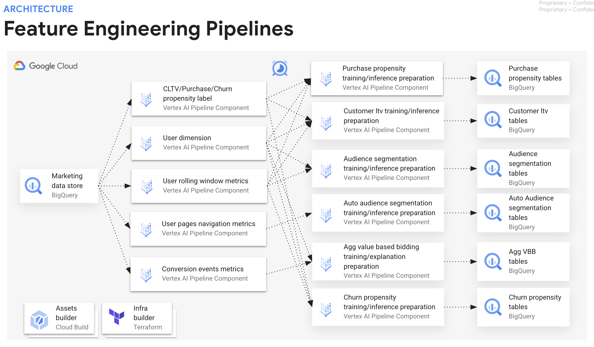
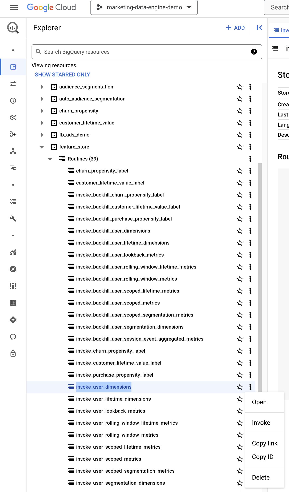
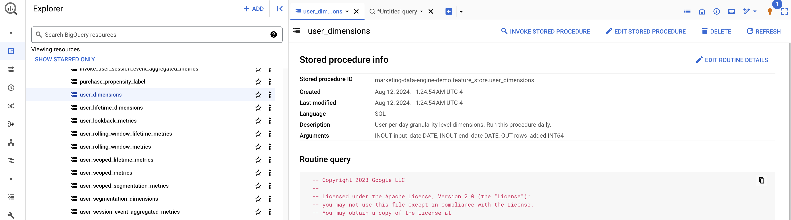

# Feature Store Guide

## Introduction

The Feature Store component involves leveraging data pipelines that transforms event-level data  into user-level feature metrics and dimensions and combining them into training and inference data to be ingested by all the ML models. The features are stored and managed in BigQuery, and they are ready to be served to different ML models and allow reproducible model training and predictions across different intervals of time.

The Feature Store transformations are implemented in BigQuery [GoogleSQL](https://cloud.google.com/bigquery/docs/introduction-sql) and are orchestrated using Vertex AI [Pipelines](https://cloud.google.com/vertex-ai/docs/pipelines/introduction). The daily features preparation is scheduled and triggered using Vertex AI [Pipelines Scheduler](https://cloud.google.com/vertex-ai/docs/pipelines/schedule-pipeline-run).

This guide details how to deploy and monitor the feature store, manually backfill features for past days, troubleshoot and customize the feature store to meet your specific requirements.

## Solution Architecture


This architecture diagram describes the feature engineering flow of data in the Feature Store component, from Marketing Data Store to the training and inference tables to be used by the ML pipelines. The Feature Store is fully orchestrated using Vertex AI Pipelines and the data platform adopted is BigQuery. The core components are:
* **Data Store**: The Marketing Data Store views and tables in the presentation layer. 
* **Transformation Procedures**:
    * For Purchase, Churn, CLTV labeling stored procedures: Event-level data is aggregated at the user-level. For each use case, specific metrics are calculated using fixed windows sizes (i.e. number of past days) and used as labels. These labels are attributed for every user in the data store.
    * For User dimensions stored procedures: Event-level data is aggregated at the user-level. For each use case, generic dimensions such as geo, device, traffic source dimension are consolidated taking in consideration the first and the last events observed for every user in the data store.
    * For User rolling windows stored procedures: Event-level data is aggregated at the user-level. For each use case, rolling windows metrics are calculated using fixed windows sizes (i.e. number of past days) and used as features. These are calculated for every user in the data store.
    * For User pages navigation stored procedures: Event-level data is aggregated at the user-level. For the Auto Audience Segmentation use case, rolling windows metrics are calculated using a fixed window size (i.e. number of past days) and used to determine which were the pages most visited in the website in that specific interval of dates. This is calculated for the most visited pages in the website, according to an configuration parameter, for every user in the data store.
    * For Conversion events stored procedures: Event-level data is aggregated daily. Every event marked as a [key event](https://support.google.com/analytics/answer/9267568) in Google Analytics 4 can be considered in this analysis. These metrics are calculated for every user in the data store. Identify [high-value conversions](https://support.google.com/google-ads/answer/14791574) and lay down a solid foundation for building and measuring data effectively. This will help you tap into the full potential of your first-party (1P) data by aligning with your business objectives.
* **Backfill Transformation Procedures**: The Feature Store provides backfill procedures that will populate features for every user at every valid past interval to enable you to train your models once you have had enabled the Google Analytics 4 BigQuery Export for enough days depending on your use case. Note that Google Analytics 4 BigQuery Export doesn't offer a backfill option. These procedures will only compute features taking into consideration the date interval available in your Marketing Data Store. 
* **Use Case Specific Training and Inference Procedures**: Training and inference procedures that can be run at any time immediately before running training or inference pipelines.

## Who is this solution for?

We heard common stories from customers who were struggling with three frequent objectives:

1. **Marketing teams looking into transforming data to solve marketing analytics use cases without the expertise in the raw data exported by the BigQuery [Data Transfer Services](https://cloud.google.com/bigquery/docs/dts-introduction)**
- These teams need a tool that can help them to easily and efficiently transform raw data into a format that can be used for analysis.
- The feature store provides a set of pre-built transformations that can be used to transform raw data into a format that is suitable for marketing analytics use cases.

2. **Data Scientists or Marketing Scientists looking into calculating features having difficulty in finding the right GoogleSQL queries to be used to obtain key metrics and user attributes**
- These teams need a repository of GoogleSQL queries that can be used to calculate common features.
- The feature store provides a library of GoogleSQL queries that can be used to calculate common features for marketing analytics use cases. These queries can be easily customized to meet the specific needs of each team.

3. **ML Engineers building automated production ready feature engineering data pipelines having to deal with backfilling and implementing consistent transformations for consolidating data for training and serving purposes**
- These teams need a platform that can help them to automate the feature engineering process.
- The feature store provides a platform that can be used to automate the feature engineering process. This platform can help to reduce the time and effort required to build and maintain feature engineering pipelines. Additionally, the feature store provides a mechanism for backfilling features and ensuring that the same transformations are applied to both training and serving data.

## Benefits of this solution

After deploying the Feature Store, Marketing Technology teams get the following benefits:

1. Productionize new features without extensive engineering support
2. Automate feature calculation, backfills, and logging
3. Share and reuse features across teams and use cases
4. Achieve consistency between training and serving data
5. Monitor the health of feature pipelines in production

## Advantages of the solution

In comparison to other approaches, Feature Store solution offers the following advantages:

* Build, share and serve features in petabyte scale using BigQuery as your data and computing layer.
* Batch feature ingestion: Support ingesting large amounts of historical feature values at high throughput. This enables backfill calculation of features for a larger date interval.
* Batch feature serving: Support serving large amounts of feature values for generating training and inference datasets.
* Schedule feature engineering pipelines for different use cases on a very simple manner.
* Support simple and complex [SQL functions and operators](https://cloud.google.com/bigquery/docs/reference/standard-sql/functions-and-operators) that allow customers to run feature aggregation based on sliding windows, function calls, conditional expressions, subqueries and [user-defined functions](https://cloud.google.com/bigquery/docs/routines) (UDF) in Javascript.
* Easy data quality analysis and feature engineering inspection.
* Troubleshooting and customizations completely done via a friendly web interface, [BigQuery Studio](https://cloud.google.com/bigquery/docs/bigquery-web-ui). Leveraging built-in Gemini insights, lineage, profiling and data quality assertions. 

## Feature Store usage by each use case

The Feature Store pre-built calculations and pipelines already implemented and used by each Use Case are listed below:

| Use Case |	Feature Store Pipeline | Stored Procedures | Vertex AI Pipeline Component | Notes |
| -------- | ------- | ---- | ---- | --- |
| Purchase Propensity | [purchase_propensity_feature_engineering_pipeline](../python/pipelines/feature_engineering_pipelines.py) | [purchase_propensity_label](../sql/procedure/purchase_propensity_label.sqlx) <br> [user_dimensions](../sql/procedure/user_dimensions.sqlx) <br> [user_rolling_window_metrics](../sql/procedure/user_rolling_window_metrics.sqlx) <br> [purchase_propensity_training_preparation](../sql/procedure/purchase_propensity_training_preparation.sqlx) <br> [purchase_propensity_inference_preparation](../sql/procedure/purchase_propensity_inference_preparation.sqlx) |	[bq_stored_procedure_exec](../python/pipelines/components/bigquery/component.py) | In the pipeline, we actually use the stored procedures with the `invoke_` prefix to the stored procedures names |
| Churn Propensity | [churn_propensity_feature_engineering_pipeline](../python/pipelines/feature_engineering_pipelines.py) | [churn_propensity_label](../sql/procedure/churn_propensity_label.sqlx) <br> [user_dimensions](../sql/procedure/user_dimensions.sqlx) <br> [user_rolling_window_metrics](../sql/procedure/user_rolling_window_metrics.sqlx) <br> [churn_propensity_training_preparation](../sql/procedure/churn_propensity_training_preparation.sqlx) <br> [churn_propensity_inference_preparation](../sql/procedure/churn_propensity_inference_preparation.sqlx) | [bq_stored_procedure_exec](../python/pipelines/components/bigquery/component.py) | In the pipeline, we actually use the stored procedures with the `invoke_` prefix to the stored procedures names |
| Customer Lifetime Value  | [customer_lifetime_value_feature_engineering_pipeline](../python/pipelines/feature_engineering_pipelines.py) | [customer_lifetime_value_label](../sql/procedure/customer_lifetime_value_label.sqlx) <br> [user_lifetime_dimensions](../sql/procedure/user_lifetime_dimensions.sqlx) <br> [user_rolling_window_lifetime_metrics](../sql/procedure/user_rolling_window_lifetime_metrics.sqlx) <br> [customer_lifetime_value_training_pipeline](../sql/procedure/customer_lifetime_value_training_preparation.sqlx) <br> [customer_lifetime_value_inference_pipeline](../sql/procedure/customer_lifetime_value_inference_preparation.sqlx) |	[bq_stored_procedure_exec](../python/pipelines/feature_engineering_pipelines.py) | In the pipeline, we actually use the stored procedures with the `invoke_` prefix to the stored procedures names |
| Demographic Audience Segmentation | [audience_segmentation_feature_engineering_pipeline](../python/pipelines/feature_engineering_pipelines.py) | [user_segmentation_dimensions](../sql/procedure/user_segmentation_dimensions.sqlx) <br> [user_lookback_metrics](../sql/procedure/user_lookback_metrics.sqlx) <br> [audience_segmentation_training_preparation]() <br> [audience_segmentation_inference_preparation]() | [bq_stored_procedure_exec](../python/pipelines/feature_engineering_pipelines.py) | In the pipeline, we actually use the stored procedures with the `invoke_` prefix to the stored procedures names |
| Interest based Audience Segmentation | [auto_audience_segmentation_feature_engineering_pipeline](../python/pipelines/feature_engineering_pipelines.py) | [auto_audience_segmentation_training_preparation](../sql/procedure/auto_audience_segmentation_training_preparation.sqlx) <br> [auto_audience_segmentation_inference_preparation](../sql/procedure/auto_audience_segmentation_inference_preparation.sqlx) | [bq_dynamic_query_exec_output](../python/pipelines/feature_engineering_pipelines.py) <br> [bq_dynamic_stored_procedure_exec_output_full_dataset_preparation](../python/pipelines/feature_engineering_pipelines.py) <br> [bq_stored_procedure_exec](../python/pipelines/feature_engineering_pipelines.py) | In the pipeline, we actually use the stored procedures with the `invoke_` prefix to the stored procedures names |
| Aggregated Value Based Bidding | [aggregated_value_based_bidding_feature_engineering_pipeline](../python/pipelines/feature_engineering_pipelines.py) | [aggregated_value_based_bidding_training_preparation](../sql/procedure/aggregated_value_based_bidding_training_preparation.sqlx) <br> [aggregated_value_based_bidding_explanation_preparation](../sql/procedure/aggregated_value_based_bidding_explanation_preparation.sqlx) | [bq_stored_procedure_exec](../python/pipelines/feature_engineering_pipelines.py) | In the pipeline, we actually use the stored procedures with the `invoke_` prefix to the stored procedures names |
| Reporting Preparation | [reporting_preparation_pl](../python/pipelines/feature_engineering_pipelines.py) | [aggregate_predictions](../sql/procedure/aggregate_predictions_procedure.sqlx) | [bq_stored_procedure_exec](../python/pipelines/feature_engineering_pipelines.py) | This is not a feature engineering pipeline, this is a pipeline that aggregates all the latest prediction tables from the models into a single table for reporting purposes |
| Gemini Insights | [gemini_insights_pl](../python/pipelines/feature_engineering_pipelines.py) | [user_scoped_metrics](../sql/procedure/user_scoped_metrics.sqlx) <br> [user_behaviour_revenue_insights](../sql/procedure/user_behaviour_revenue_insights.sqlx) | [bq_stored_procedure_exec](../python/pipelines/feature_engineering_pipelines.py) | This is not a feature engineering pipeline, this is a pipeline that generate gemini insights on user behaviour and revenue metrics aggregated daily, weekly and monthly |

## Feature Store Design Principles

When building the Feature Store, the following principles are considered:

1. **ML Use-Cases compatible.**
At a minimum, the feature store must provide a set of appropriate features to deploy the existing Marketing Analytics use-cases. Our assumption is that the user-centric analytics dimensions and metrics present in the [Google Analytics 4 reports](https://support.google.com/analytics/table/13948007?hl=en), are a robust set of features from which we can derive GoogleSQL code to turn those dimensions and metrics into features.

2. **We are designing for the average marketer...** 
We will not attempt to include all features an organization will have or should have available. We will focus on the most common features based on our conversations with customers. For technical skillset, we can assume intermediate SQL and beginner programming knowledge. We cannot assume data science knowledge.

3. **... but can be extended for the advanced marketer.** 
The feature store should be extendible so that it can be customized to the marketer's unique business needs and include other features or use-cases that are not in our scope. Teams with an advanced technical skillset will find the solution valuable as a foundation to build on top of. 

4. **Product Sales-centric.**
Every type of business (Lead Gen, CPG, M&E, Finance, Public Sector, etc.) will dictate a variation of the feature store. For the first version of the feature store, we will focus on a product sales-centric (both ecommerce and brick and mortar) business as that is the vast majority of requests.

6. **Strictly Star Schema.**
While the solution will leverage BigQuery, this feature store design document will not address any BQ-centric optimization. This optimization may occur in the Execution phase. We remove that constraint to simplify our discussions in this document on the feature store.

7. **Keep Identity Spaces Separate.**
Per Legal's guidance, Google is not allowed to provide guidance or assistance on stitching together user identity across identity spaces. That guidance and work should be deferred to partners. However, per Design Principle 3, we should not prohibit that from being built. The Marketing Analytics team is of the opinion that identity stitching is best deferred to a partner-driven "Customer Data Platform" conversation. 

8. Follows Feature Store best practices. 
Feature store is architected based on industry best practices for Feature Stores.

## What is deployed to Google Cloud?

This section provides a detailed overview of the Google Cloud resources deployed as part of the Feature Store.

| Google Cloud Resource | Resource Name | Resource Link |
| -------- | ------- | -------- |
| APIs & Services | Vertex AI API, Cloud Logging API, Artifact Registry API, Compute Engine API, Cloud Monitoring API, BigQuery API, Cloud Build API, Secret Manager API, Cloud Pub/Sub API, Workflows API, Eventarc API, Google Analytics Admin API, Dataform API, Cloud Functions API, Cloud Resource Manager API, Cloud Dataplex API, Cloud Scheduler API, Workflow Executions API, Container Analysis API, Cloud Run Admin API, Looker API | [APIs & Services](images/apis_services.png) |
| BigQuery Datasets & Tables | marketing_ads_base_prod, marketing_ads_v1_prod, marketing_assertions, marketing_ga4_analysis_prod, marketing_ga4_base_prod, marketing_ga4_feature_prod, marketing_ga4_v1_prod | [BigQuery Datasets](images/feature_store_bigquery_datasets.png) |
| BigQuery Stored Procedures | aggregate_predictions_procedure <br> aggregated_value_based_bidding_.. <br> audience_segmentation_.. <br> auto_audience_segmentation_.. <br> churn_propensity_.. <br> customer_lifetime_value_.. <br> purchase_propensity_.. <br> user_behaviour_revenue_insights <br> user_dimensions <br> user_lifetime_dimensions <br> user_lookback_metrics <br> user_rolling_window_lifetime_metrics <br> user_rolling_window_metrics <br> .. <br> create_gemini_model <br> invoke_aggregated_value_based_bidding_.. <br> invoke_audience_segmentation_.. <br> invoke_auto_audience_segmentation.. <br> invoke_backfill_.. <br> invoke_churn_propensity_.. <br> invoke_customer_lifetime_value_.. <br> invoke_purchase_propensity_.. <br> invoke_user_behaviour_revenue_insights <br> invoke_user_.. | BigQuery Stored Procedures [1](images/feature_store_procedures.png) [2](images/feature_store_procedures_2.png) [3](images/feature_store_procedures_3.png) [4](images/feature_store_procedures_4.png) [5](images/feature_store_procedures_5.png) [6](images/feature_store_procedures_6.png) [7](images/feature_store_procedures_7.png) [8](images/feature_store_procedures_8.png) |
| BigQuery Connection | vertex_ai_connection | [BigQuery Connection](images/feature_store_bigquery_connection.png) |

**Note:**
The BigQuery stored procedures are orchestrated by Vertex AI Pipelines, deploy the ML Pipelines module to have these stored procedures for each use case properly orchestrated and scheduled.

If you cannot find all the resources listed above, there are a few possible reasons.
- Incomplete Deployment: If the deployment process has not yet completed, some resources may still be in the process of being created.
- Deployment Errors: If there were errors during the deployment process, some resources may not have been created successfully.
- Insufficient Permissions: If you do not have the necessary permissions to view all the resources, you may not be able to see them.
- Insufficient Quotas: If you do not have enough quota to view all the resources, you may not be able to see them. You can request quota increases from [Google Cloud console](https://cloud.google.com/docs/quotas/view-manage).

## Manually Backfilling Feature Store

On the Google Cloud console, navigate to BigQuery Explorer page. You will see the `feature_store` dataset, expand the `Routines` section and you will find all the stored procedures with the `invoke_backfill_` prefix. To manually trigger an individual stored procedure, click on the three dots, then click `Invoke`. Finally, on the opened tab click the `RUN` button.

Check the Post-Installation instructions on the installation guide to make sure you manually backfill the feature store whenever you've just completed the installation.

## Manually Triggering Feature Store Pipelines

You can trigger your Vertex AI Pipeline to execute your feature engineering workflow at any time, or you can wait until the next day when the Vertex AI Pipeline is going to be executed according to your schedule. There are two components in this solution that requires data for proper installation and functioning. One is the Looker Studio Dashboard, you only deploy the dashboard after you have had executed all the steps in the [Post Installation Instructions](../infrastructure/terraform/README.md#post-installation-instructions) successfully.



On the Google Cloud console, navigate to BigQuery Explorer page. You will see the `feature_store` dataset, expand the `Routines` section and you will find all the stored procedures. To manually trigger an individual stored procedure, click on the three dots, then click `Invoke`. Finally, on the opened tab click the `RUN` button.

**Note**: You can directly edit the stored procedures using the BigQuery Studio UI. However, to make persistent changes, apply those changes directly to the code base and redeploy the feature store. 

## Customize Features Store Calculations

To customize the features store calculations, you're going to need to setup your development environment. Start by reading the [LICENSE](https://github.com/GoogleCloudPlatform/marketing-analytics-jumpstart/blob/main/LICENSE) and [CONTRIBUTING](https://github.com/GoogleCloudPlatform/marketing-analytics-jumpstart/blob/main/CONTRIBUTING.md) guides for the [Marketing Analytics Jumpstart Dataform](https://github.com/GoogleCloudPlatform/marketing-analytics-jumpstart) repository. Next, read the GitHub documentation to learn [contributing to a project](https://docs.github.com/en/get-started/exploring-projects-on-github/contributing-to-a-project). As soon as you forked the repository, deploy the feature store using Terraform apply. Make sure the `deploy_feature_store` variable is set to `true`.

```shell
...
# Choose which components you still wish to deploy, if unsure leave as "false".
deploy_activation    = true
deploy_feature_store = true
deploy_pipelines     = true
...
```

Then, deploy the Marketing Analytics Jumpstart following the [installation guide](../infrastructure/terraform/README.md). 

Once, the Feature Store is deployed and you have backfilled data to it. You can start experimenting running your own custom features calculations, removing features that you don't have data to calculate them, for example.

We recommend you modify the stored procedure using BigQuery Studio UI, by clicking on the stored procedure and click on `EDIT STORED PROCEDURE` button. Once you're don with your changes, click on `SAVE` button.



## Implement new features into the Feature Store

To implement new features into the Feature Store, once you have setup your development environment. Create new stored procedures, if necessary, validate feature quality using BigQuery Studio UI tools such as Profiling and running other queries.

To add new features to the feature store module, follow these steps:
1. Create a new `.sqlx` file under the `sql/` folder 
2. Add specific JINJA templated configuration on a new block in your `config.yaml.tftpl` file
3. Add a new terraform resource in your [bigquery-procedure.tf](../infrastructure/terraform/modules/feature-store/bigquery-procedures.tf) file
4. [Optionally] Add a new terraform resource in [bigquery-tables.tf](../infrastructure/terraform/modules/feature-store/bigquery-tables.tf) file, for every table you want it to persistently store data in BigQuery.

# Troubleshooting

## When not using all ecommerce events in Google Analytics 4. Which changes I must do?

For example, let's say you don't use 'begin_checkout' events. In that case, you need to adjust your SQL code to handle the missing event. 
At first, search all SQL files in which 'begin_checkout' is mentioned and check the code documentation to understand how it is used in the metrics calculations.
Then, plan on how you would redefine the formula to determine cart abandonment. 

Here's a breakdown of the changes and the reasoning behind them:

**1. Cart Abandonment Logic:**

* **Current Logic:** The code currently identifies cart abandonment based on the presence of 'begin_checkout' events without corresponding 'purchase' events within the same day.
* **New Logic (Without 'begin_checkout'):** You'll need a new definition of cart abandonment. Here are a few options:
* **Option 1: 'add_to_cart' without 'purchase':** Identify users who added items to their cart ('add_to_cart' event) but didn't complete a purchase on the same day.
* **Option 2: Time-based abandonment:** Define a time threshold (e.g., 24 hours) after an 'add_to_cart' event. If a user doesn't make a purchase within that timeframe, consider it an abandoned cart.
* **Option 3: Utilize other events:** If you have other events that might signal intent to purchase (e.g., 'view_cart', 'proceed_to_payment'), you can incorporate those into your logic.

**2. Modify the SQL Code:**

* **Remove/Modify Temporary Tables:**
* **`returned_cart_to_purchase`:** This table is entirely dependent on the 'begin_checkout' event. You should remove it.
* **`cart_to_purchase`:** Modify this table's logic to reflect your chosen definition of cart abandonment (see options above).

* **Example Modification (Using Option 1):**
```sql
-- ... (previous code) ...

-- Has the user abandoned any cart by day?
CREATE OR REPLACE TEMP TABLE cart_to_purchase AS (
SELECT
GA.user_pseudo_id,
input_date as feature_date,
-- Check for 'add_to_cart' without 'purchase' on the same day
CASE
WHEN SUM(CASE WHEN event_name = 'add_to_cart' THEN 1 ELSE 0 END) > 0 -- At least one 'add_to_cart'
AND SUM(CASE WHEN event_name = 'purchase' THEN 1 ELSE 0 END) = 0 -- No 'purchase' events
THEN True
ELSE False
END AS has_abandoned_cart
FROM `{{mds_project_id}}.{{mds_dataset}}.event` AS GA
INNER JOIN `{{mds_project_id}}.{{mds_dataset}}.device` as D
ON GA.device_type_id = D.device_type_id
CROSS JOIN dates_interval as DI
WHERE event_date BETWEEN DI.end_date AND DI.input_date
AND GA.ga_session_id IS NOT NULL
AND D.device_os IS NOT NULL
GROUP BY user_pseudo_id, feature_date
);

-- ... (rest of the code) ...
```

**3. Adjust Feature Importance (Optional):**

* Without 'begin_checkout', the `has_abandoned_cart` feature might have different predictive power for your models. Consider evaluating its importance after making these changes and retraining your models.

**Important Considerations:**

* **Business Context:** The most appropriate definition of cart abandonment depends on your specific business context and the events you collect.
* **Data Exploration:** Before making changes, thoroughly explore your data to understand user behavior and identify potential alternative events to define cart abandonment effectively.
* **Model Retraining:** After modifying your SQL and feature engineering, you'll need to retrain your models to ensure they learn from the updated data.


## When the business is high-value and infrequent items purchases. Which changes I must do?

The use cases implemented calculates the purchase-related features on a daily basis. However, your customers typically buy once every five to ten years. This means you need to adjust the code to capture long-term purchase behavior instead of focusing solely on daily activities. Here's how you can modify the code.

**1. Expand Feature Calculation Window:**

- **Current Approach:** The code uses `dates_interval` with `interval_end_date` set to 180 days, limiting the feature calculation window to six months.
- **Proposed Change:** Instead of daily features, calculate features over a longer period, such as yearly or multi-year windows. This will help capture purchase patterns over a timeframe more relevant to your customer behavior.

```sql
-- Example: Calculate features yearly
CREATE OR REPLACE TEMP TABLE dates_interval as (
SELECT DISTINCT 
CAST(FORMAT_DATE('%Y', event_date) AS INT64) AS feature_year,
DATE(CAST(FORMAT_DATE('%Y', event_date) AS INT64), 1, 1) as start_date,
DATE(CAST(FORMAT_DATE('%Y', event_date) AS INT64) + 1, 1, 1) as end_date
FROM `{{mds_project_id}}.{{mds_dataset}}.event`
);
```

- **Adjust Joins:** Modify subsequent queries to join on `feature_year` instead of `feature_date` to aggregate data over the new time window.

**2. Recalculate Features for Long-Term Behavior:**

- **Purchase Frequency:** Instead of `how_many_purchased_before` on a daily basis, calculate the total number of purchases a user has made within the entire feature window (e.g., total purchases in the past 5 or 10 years).

```sql
-- Example: Calculate total purchases in the feature window
CREATE OR REPLACE TEMP TABLE repeated_purchase as (
SELECT
user_pseudo_id,
feature_year,
COUNT(DISTINCT CASE WHEN event_name = 'purchase' THEN event_timestamp ELSE NULL END) AS total_purchases
FROM `{{mds_project_id}}.{{mds_dataset}}.event` AS GA
INNER JOIN dates_interval AS DI
ON GA.event_date BETWEEN DI.start_date AND DI.end_date
GROUP BY user_pseudo_id, feature_year
);
```

- **Recency Features:** Calculate features that capture how long it has been since a user's last purchase. Examples include:
- Days since last purchase (at the start of the feature window)
- Years since last purchase

- **Average Purchase Value:** Calculate the average value of a user's purchases within the feature window.

**3. Consider Time-Based Features:**

- **Seasonality:** If there are seasonal trends in your data (e.g., more purchases during holidays), create features to capture these patterns. For example, you could have a feature indicating the quarter or month of the year.
- **Trends:** Calculate features that capture trends in user behavior over time, such as the change in purchase frequency or average purchase value compared to previous periods.

**4. Data Aggregation and Feature Store:**

- **Aggregate Data:** Once you have calculated features over longer time windows, aggregate your data to create a user-level feature store. Each row in the feature store would represent a user, and the columns would be the calculated features.
- **Feature Freshness:** Determine the appropriate update frequency for your feature store. Given the infrequent purchase behavior, updating the feature store less frequently (e.g., monthly or quarterly) might be suitable.

**Example Code Snippet (Recency Feature):**

```sql
CREATE OR REPLACE TEMP TABLE recency_features AS (
SELECT
user_pseudo_id,
feature_year,
DATE_DIFF(DI.start_date, MAX(event_date), DAY) AS days_since_last_purchase
FROM `{{mds_project_id}}.{{mds_dataset}}.event` AS GA
INNER JOIN dates_interval AS DI
ON GA.event_date BETWEEN DI.start_date AND DI.end_date
WHERE event_name = 'purchase'
GROUP BY user_pseudo_id, feature_year
);
```

Remember to adapt these suggestions to your specific business context and the available data in your Google Analytics 4 tables. By adjusting the feature calculation window, focusing on long-term purchase behavior, and incorporating time-based features, you can create a more relevant and valuable feature store for modeling customer behavior with infrequent purchases.