# Marketing Analytics Jumpstart Dashboard

## Background

This Looker Studio dashboard is intended to be a starting point for the visualization of your Marketing Analytics Jumpstart output using some common descriptive analytics for GA4 and Google Ads.

## Data Sources

The dashboard utilizes the product views that are generated by the Dataform pipelines generated in this repo.

| **Data Source Name**                 | **BQ Dataset**        | **BQ View**                    | **Looker Studio Alias** |
|--------------------------------------|-----------------------|--------------------------------|-------------------------|
| MDS GA4 Sessions                     | marketing_ga4_v1_prod | session_date                   | GA4_sessions            |
| MDS GA4 Sessions Device              | marketing_ga4_v1_prod | session_device_daily_metrics   | GA4_session_device      |
| MDS GA4 Session Location             | marketing_ga4_v1_prod | session_location_daily_metrics | GA4_session_location    |
| MDS GA4 Event Page                   | marketing_ga4_v1_prod | event_page                     | GA4_event_page          |
| MDS GA4 Unique Page Views            | marketing_ga4_v1_prod | unique_page_views              | GA4_unique_page_views   |
| MDS GA4 Page Session                 | marketing_ga4_v1_prod | page_session_daily_metrics     | GA4_page_session        |
| MDS Ads Ad Performance x Conversions | marketing_ads_v1_prod | ad_performance_conversions     | Ads_perf_conversions    |

## Visualization Details

## Overview Page

This is an existing page carried over from the Marketing Analytics demo dashboard. It combines common metrics for both Google Ads and GA4 exports in one overview dashboard.

### Ad Campaign Performance

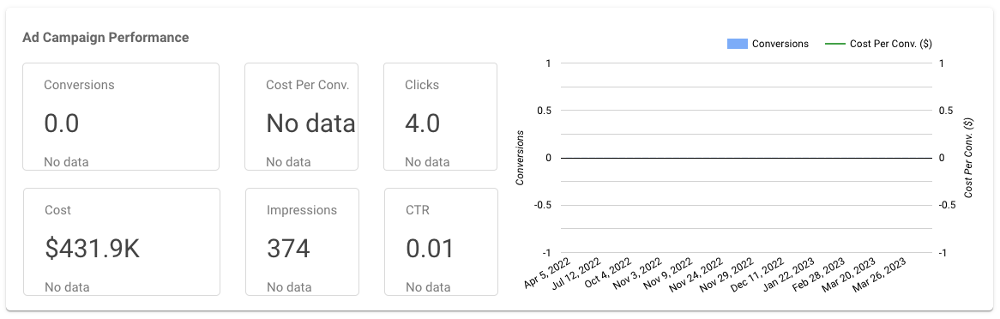

---

Conversions Scorecard Metric

<table>
  <tr>
    <td><p><strong>Type</strong></p></td> 
    <td><p>Scorecard chart</p></td>
  </tr>
  <tr>
    <td><p><strong>Data Source</strong></p></td> 
    <td><p>MDS Ads Ad Performance x Conversions</p></td>
  </tr>
  <tr>
    <td><p><strong>Date Range Dimension</strong></p></td> 
    <td><p>date</p></td>
  </tr>
  <tr>
    <td><p><strong>Metric</strong></p></td> 
    <td><p>SUM(Conversions)</p></td>
  </tr>
  <tr>
    <td><p><strong>Comparison Date Range</strong></p></td> 
    <td><p>Previous Period</p></td>
  </tr>
  <tr>
    <td><p><strong>Description</strong></p></td> 
    <td><p>Displays the count of conversions for the date range selected in the page filter.</p></td>
  </tr>
</table>

Cost Per Conversion Scorecard Metric

<table>
  <tr>
    <td><p><strong>Type</strong></p></td> 
    <td><p>Scorecard chart</p></td>
  </tr>
  <tr>
    <td><p><strong>Data Source</strong></p></td> 
    <td><p>MDS Ads Ad Performance x Conversions</p></td>
  </tr>
  <tr>
    <td><p><strong>Date Range Dimension</strong></p></td> 
    <td><p>date</p></td>
  </tr>
  <tr>
    <td><p><strong>Metric</strong></p></td> 
    <td><p>SUM(cost) / SUM(conversions)</p></td>
  </tr>
  <tr>
    <td><p><strong>Comparison Date Range</strong></p></td> 
    <td><p>Previous Period</p></td>
  </tr>
  <tr>
    <td><p><strong>Description</strong></p></td> 
    <td><p>Displays the <a href="https://support.google.com/google-ads/answer/6396841?hl=en&sjid=10296453092719145927-NA"> cost per conversion</a> for the date range selected in the page filter.</p></td>
  </tr>
</table>

Clicks Scorecard Metric

<table>
  <tr>
    <td><p><strong>Type</strong></p></td> 
    <td><p>Scorecard chart</p></td>
  </tr>
  <tr>
    <td><p><strong>Data Source</strong></p></td> 
    <td><p>MDS Ads Ad Performance x Conversions</p></td>
  </tr>
  <tr>
    <td><p><strong>Date Range Dimension</strong></p></td> 
    <td><p>date</p></td>
  </tr>
  <tr>
    <td><p><strong>Metric</strong></p></td> 
    <td><p>SUM(Clicks)</p></td>
  </tr>
  <tr>
    <td><p><strong>Comparison Date Range</strong></p></td> 
    <td><p>Previous Period</p></td>
  </tr>
  <tr>
    <td><p><strong>Description</strong></p></td> 
    <td><p>Displays the count of clicks for the date range selected in the page filter.</p></td>
  </tr>
</table>

Cost Scorecard Metric

<table>
  <tr>
    <td><p><strong>Type</strong></p></td> 
    <td><p>Scorecard chart</p></td>
  </tr>
  <tr>
    <td><p><strong>Data Source</strong></p></td> 
    <td><p>MDS Ads Ad Performance x Conversions</p></td>
  </tr>
  <tr>
    <td><p><strong>Date Range Dimension</strong></p></td> 
    <td><p>date</p></td>
  </tr>
  <tr>
    <td><p><strong>Metric</strong></p></td> 
    <td><p>SUM(Cost)</p></td>
  </tr>
  <tr>
    <td><p><strong>Comparison Date Range</strong></p></td> 
    <td><p>Previous Period</p></td>
  </tr>
  <tr>
    <td><p><strong>Description</strong></p></td> 
    <td><p>Displays the total cost (in USD) for the date range selected in the page filter.</p></td>
  </tr>
</table>

Impressions Scorecard Metric

<table>
  <tr>
    <td><p><strong>Type</strong></p></td> 
    <td><p>Scorecard chart</p></td>
  </tr>
  <tr>
    <td><p><strong>Data Source</strong></p></td> 
    <td><p>MDS Ads Ad Performance x Conversions</p></td>
  </tr>
  <tr>
    <td><p><strong>Date Range Dimension</strong></p></td> 
    <td><p>date</p></td>
  </tr>
  <tr>
    <td><p><strong>Metric</strong></p></td> 
    <td><p>SUM(Impressions)</p></td>
  </tr>
  <tr>
    <td><p><strong>Comparison Date Range</strong></p></td> 
    <td><p>Previous Period</p></td>
  </tr>
  <tr>
    <td><p><strong>Description</strong></p></td> 
    <td><p>Displays the count of impressions for the date range selected in the page filter.</p></td>
  </tr>
</table>

CTR Scorecard Metric

<table>
  <tr>
    <td><p><strong>Type</strong></p></td> 
    <td><p>Scorecard chart</p></td>
  </tr>
  <tr>
    <td><p><strong>Data Source</strong></p></td> 
    <td><p>MDS Ads Ad Performance x Conversions</p></td>
  </tr>
  <tr>
    <td><p><strong>Date Range Dimension</strong></p></td> 
    <td><p>date</p></td>
  </tr>
  <tr>
    <td><p><strong>Metric</strong></p></td> 
    <td><p>SUM(clicks)/SUM(impressions)</p></td>
  </tr>
  <tr>
    <td><p><strong>Comparison Date Range</strong></p></td> 
    <td><p>Previous Period</p></td>
  </tr>
  <tr>
    <td><p><strong>Description</strong></p></td> 
    <td><p>Displays the <a href="https://support.google.com/google-ads/answer/2615875?hl=en"> Click Through Rate</a> for the date range selected in the page filter.</p></td>
  </tr>
</table>

Conversions / Cost Per Conversion Combo Chart

<table>
  <tr>
    <td><p><strong>Type</strong></p></td> 
    <td><p>Combo Chart</p></td>
  </tr>
  <tr>
    <td><p><strong>Data Source</strong></p></td> 
    <td><p>MDS Ads Ad Performance x Conversions</p></td>
  </tr>
  <tr>
    <td><p><strong>Date Range Dimension</strong></p></td> 
    <td><p>date</p></td>
  </tr>
  <tr>
    <td><p><strong>Metrics</strong></p></td> 
    <td><p>Conversions: SUM(Conversions)</p><p>Cost Per Conversion: SUM(cost)/SUM(conversions)</p></td>
  </tr>
  <tr>
    <td><p><strong>Description</strong></p></td> 
    <td><p>Displays the count of conversions and <a href="https://support.google.com/google-ads/answer/6396841?hl=en&sjid=10296453092719145927-NA"> cost per conversion</a> overlaid together for the date range selected in the page filter.</p></td>
  </tr>
</table>

### Web Traffic Scorecards

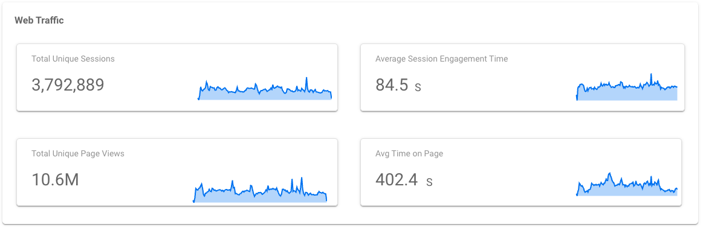

---

#### Total Unique Sessions 

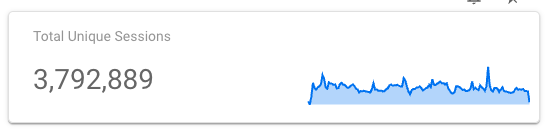

Total Unique Sessions Scorecard Metric

<table>
  <tr>
    <td><p><strong>Type</strong></p></td> 
    <td><p>Scorecard chart</p></td>
  </tr>
  <tr>
    <td><p><strong>Data Source</strong></p></td> 
    <td><p>MDS GA4 Sessions</p></td>
  </tr>
  <tr>
    <td><p><strong>Date Range Dimension</strong></p></td> 
    <td><p>session_date</p></td>
  </tr>
  <tr>
    <td><p><strong>Metric</strong></p></td> 
    <td><p>Session Count</p></td>
  </tr>
  <tr>
    <td><p><strong>Description</strong></p></td> 
    <td><p>Displays the count of unique sessions for the date range selected in the page filter.</p></td>
  </tr>
</table>

Total Unique Sessions Chart Metric

<table>
  <tr>
    <td><p><strong>Type</strong></p></td> 
    <td><p>Area chart</p></td>
  </tr>
  <tr>
    <td><p><strong>Data Source</strong></p></td> 
    <td><p>MDS GA4 Sessions</p></td>
  </tr>
  <tr>
    <td><p><strong>Date Range Dimension</strong></p></td> 
    <td><p>session_date</p></td>
  </tr>
  <tr>
    <td><p><strong>Dimension</strong></p></td> 
    <td><p>session_date (ISO Year Week)</p></td>
  </tr>
  <tr>
    <td><p><strong>Metric</strong></p></td> 
    <td><p>Session Count</p></td>
  </tr>
  <tr>
    <td><p><strong>Breakdown Dimension Sort</strong></p></td> 
    <td><p>Session Count</p></td>
  </tr>
  <tr>
    <td><p><strong>Breakdown Dimension</strong></p></td> 
    <td><p>Platform</p></td>
  </tr>
  <tr>
    <td><p><strong>Description</strong></p></td> 
    <td><p>Shows the total unique sessions for each platform broken down by ISOYEAR and ISOWEEK for the date range selected in the page filter.</p></td>
  </tr>
</table>

---

#### Average Session Engagement Time 


Average Session Engagement Time Scorecard Metric

<table>
  <tr>
    <td><p><strong>Type</strong></p></td> 
    <td><p>Scorecard chart</p></td>
  </tr>
  <tr>
    <td><p><strong>Data Source</strong></p></td> 
    <td><p>MDS GA4 Sessions</p></td>
  </tr>
  <tr>
    <td><p><strong>Date Range Dimension</strong></p></td> 
    <td><p>session_date</p></td>
  </tr>
  <tr>
    <td><p><strong>Metric</strong></p></td> 
    <td><p>AVG(engagement_time_secs)</p></td>
  </tr>
  <tr>
    <td><p><strong>Description</strong></p></td> 
    <td><p>Displays the average session engagement time across all sessions for the selected date range in the page filter.</p></td>
  </tr>
</table>

Average Session Engagement Time Chart Metric

<table>
  <tr>
    <td><p><strong>Type</strong></p></td> 
    <td><p>Area chart</p></td>
  </tr>
  <tr>
    <td><p><strong>Data Source</strong></p></td> 
    <td><p>MDS GA4 Sessions</p></td>
  </tr>
  <tr>
    <td><p><strong>Date Range Dimension</strong></p></td> 
    <td><p>session_date</p></td>
  </tr>
  <tr>
    <td><p><strong>Dimension</strong></p></td> 
    <td><p>session_date (ISO Year Week)</p></td>
  </tr>
  <tr>
    <td><p><strong>Metric</strong></p></td> 
    <td><p>Session Count</p></td>
  </tr>
  <tr>
    <td><p><strong>Breakdown Dimension Sort</strong></p></td> 
    <td><p>AVG(engagement_time_secs)</p></td>
  </tr>
  <tr>
    <td><p><strong>Breakdown Dimension</strong></p></td> 
    <td><p>Platform</p></td>
  </tr>
  <tr>
    <td><p><strong>Description</strong></p></td> 
    <td><p>Shows the average session engagement time for each platform broken down by ISOYEAR and ISOWEEK for the date range selected in the page filter.</p></td>
  </tr>
</table>

---

#### Total Unique Pageviews 

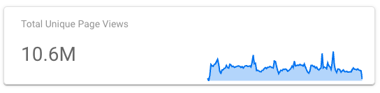

Total Unique Pageviews Scorecard Metric

<table>
  <tr>
    <td><p><strong>Type</strong></p></td> 
    <td><p>Scorecard chart</p></td>
  </tr>
  <tr>
    <td><p><strong>Data Source</strong></p></td> 
    <td><p>MDS GA4 Unique Page Views</p></td>
  </tr>
  <tr>
    <td><p><strong>Date Range Dimension</strong></p></td> 
    <td><p>event_date</p></td>
  </tr>
  <tr>
    <td><p><strong>Metric</strong></p></td> 
    <td><p>SUM(Record Count)</p></td>
  </tr>
  <tr>
    <td><p><strong>Description</strong></p></td> 
    <td><p>Displays the total unique page views for the date range selected in the page filter.</p></td>
  </tr>
</table>

Total Unique Pageviews Chart Metric

<table>
  <tr>
    <td><p><strong>Type</strong></p></td> 
    <td><p>Area chart</p></td>
  </tr>
  <tr>
    <td><p><strong>Data Source</strong></p></td> 
    <td><p>MDS GA4 Unique Page Views</p></td>
  </tr>
  <tr>
    <td><p><strong>Date Range Dimension</strong></p></td> 
    <td><p>event_date</p></td>
  </tr>
  <tr>
    <td><p><strong>Dimension</strong></p></td> 
    <td><p>event_date (ISO Year Week)</p></td>
  </tr>
  <tr>
    <td><p><strong>Metric</strong></p></td> 
    <td><p>SUM(Record Count)</p></td>
  </tr>
  <tr>
    <td><p><strong>Breakdown Dimension Sort</strong></p></td> 
    <td><p>Record Count</p></td>
  </tr>
  <tr>
    <td><p><strong>Breakdown Dimension</strong></p></td> 
    <td><p>Platform</p></td>
  </tr>
  <tr>
    <td><p><strong>Description</strong></p></td> 
    <td><p>Shows the total unique page views for each platform broken down by ISOYEAR and ISOWEEK for the date range selected in the page filter.</p></td>
  </tr>
</table>

---

#### Avg Time on Page 

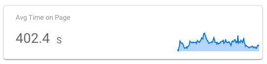

Avg Time on Page Scorecard Metric

<table>
  <tr>
    <td><p><strong>Type</strong></p></td> 
    <td><p>Scorecard chart</p></td>
  </tr>
  <tr>
    <td><p><strong>Data Source</strong></p></td> 
    <td><p>MDS GA4 Event Page</p></td>
  </tr>
  <tr>
    <td><p><strong>Date Range Dimension</strong></p></td> 
    <td><p>event_date</p></td>
  </tr>
  <tr>
    <td><p><strong>Metric</strong></p></td> 
    <td><p>SUM(engagement_time_secs)/</p><p>COUNT_DISTINCT(page)</p></td>
  </tr>
  <tr>
    <td><p><strong>Description</strong></p></td> 
    <td><p>Displays the average time spent on a page for the date range selected in the page filter.</p></td>
  </tr>
</table>

Avg Time on Page Chart Metric

<table>
  <tr>
    <td><p><strong>Type</strong></p></td> 
    <td><p>Area chart</p></td>
  </tr>
  <tr>
    <td><p><strong>Data Source</strong></p></td> 
    <td><p>MDS GA4 Event Page</p></td>
  </tr>
  <tr>
    <td><p><strong>Date Range Dimension</strong></p></td> 
    <td><p>event_date</p></td>
  </tr>
  <tr>
    <td><p><strong>Dimension</strong></p></td> 
    <td><p>event_date (ISO Year Week)</p></td>
  </tr>
  <tr>
    <td><p><strong>Metric</strong></p></td> 
    <td><p>SUM(engagement_time_secs)/</p><p>COUNT_DISTINCT(page)</p></td>
  </tr>
  <tr>
    <td><p><strong>Breakdown Dimension Sort</strong></p></td> 
    <td><p>Record Count</p></td>
  </tr>
  <tr>
    <td><p><strong>Breakdown Dimension</strong></p></td> 
    <td><p>Platform</p></td>
  </tr>
  <tr>
    <td><p><strong>Description</strong></p></td> 
    <td><p>Shows the average time spent on a page for each platform broken down by ISOYEAR and ISOWEEK for the date range selected in the page filter.</p></td>
  </tr>
</table>

## Ad Campaign Performance

A similar view to the ads data in the [Overview Page](#overview-page) but features some additional charts for Ad Campaign performance analysis.

One key difference is that the area charts have a granular date dimension to allow more detailed analysis for a smaller period of time.

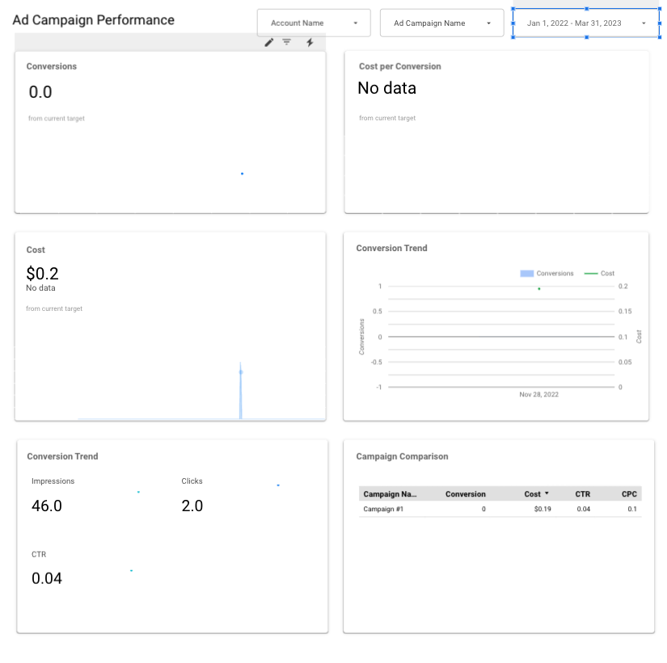

## Ad Campaign Comparison

A similar view to the ads data in the [Overview Page](#heading=h.mw1c6uotr92) and [Ad Campaign Performance](#heading=h.8m10frl7kxdu) but is designed to allow comparison across campaigns.

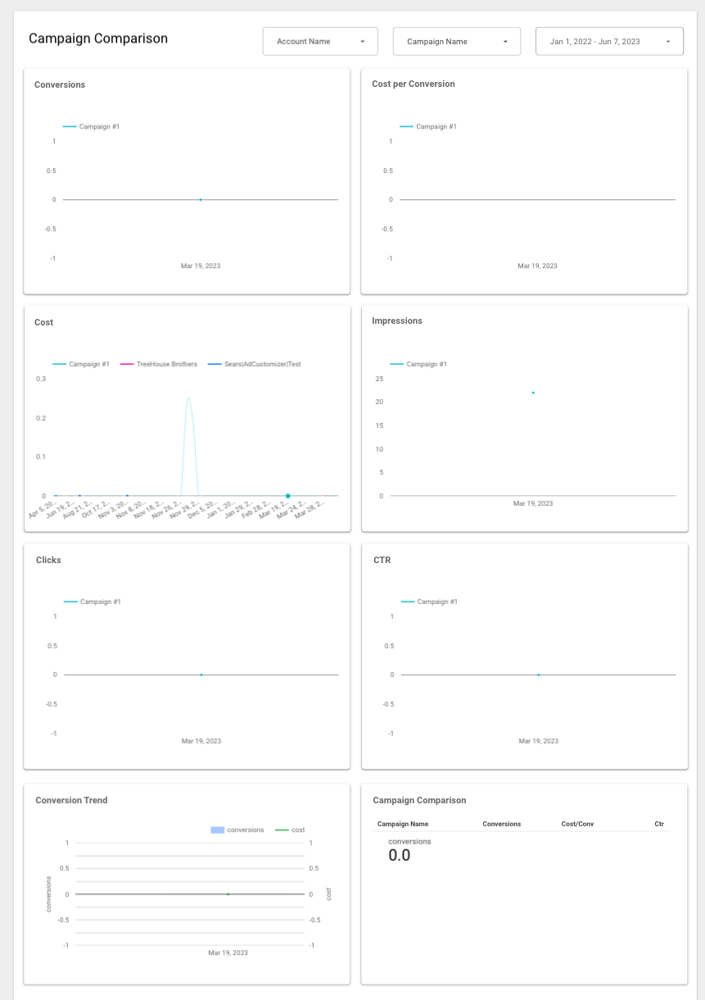

## Web Traffic

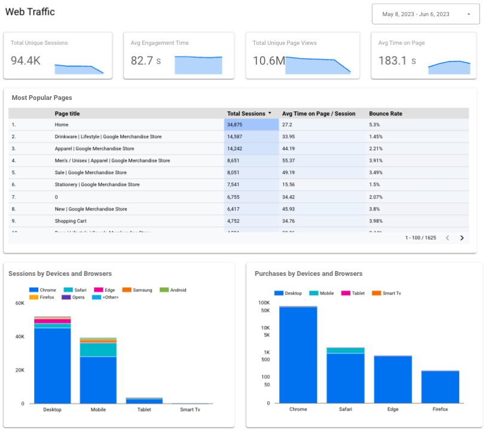

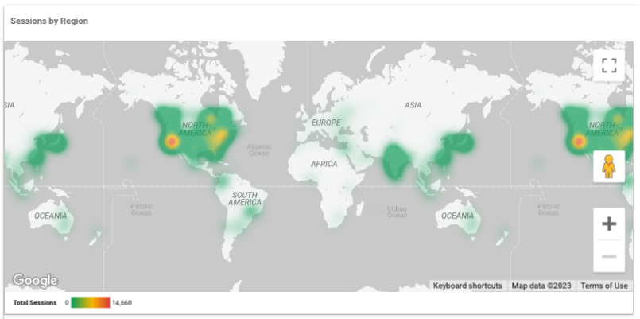

---

### Scorecards

Same as [Web Traffic Scorecards](#web-traffic-scorecards)

---

### Charts

#### Most Popular Pages Chart 

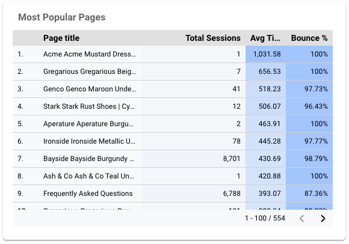

**Properties**

<table>
  <tr>
    <td><p><strong>Type</strong></p></td> 
    <td><p>Table with heatmap</p></td>
  </tr>
  <tr>
    <td><p><strong>Data Source</strong></p></td> 
    <td><p>MDS GA4 Page Session</p></td>
  </tr>
  <tr>
    <td><p><strong>Date Range Dimension</strong></p></td> 
    <td><p>event_date</p></td>
  </tr>
  <tr>
    <td><p><strong>Dimension</strong></p></td> 
    <td><p>page_title</p></td>
  </tr>
  <tr>
    <td><p><strong>Sort</strong></p></td> 
    <td><p>session_count</p></td>
  </tr>
</table>

**Metrics**

Total Sessions Metric

```
SUM(total_sessions)
```

Avg Time on Page / Sessions

```
SUM(total_engagement_time_sec)/SUM(session_count)
```

[Bounce Rate](https://support.google.com/analytics/answer/12195621?hl=en)

```
SUM(bounced_count)/SUM(session_count)
```

#### Sessions by Devices and Browsers 

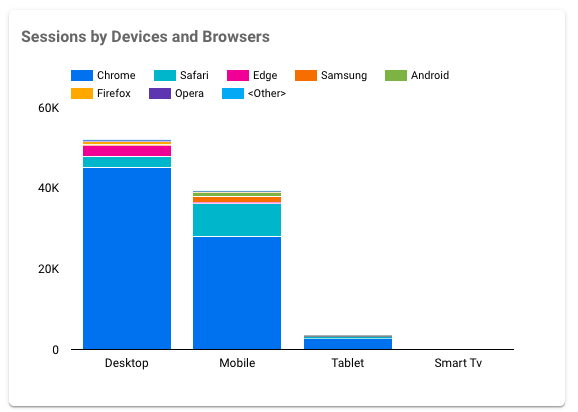

**Properties**

<table>
  <tr>
    <td><p><strong>Type</strong></p></td> 
    <td><p>Stacked column chart</p></td>
  </tr>
  <tr>
    <td><p><strong>Data Source</strong></p></td> 
    <td><p>MDS GA4 Session Device</p></td>
  </tr>
  <tr>
    <td><p><strong>Date Range Dimension</strong></p></td> 
    <td><p>event_date</p></td>
  </tr>
  <tr>
    <td><p><strong>Dimension</strong></p></td> 
    <td><p>device_category</p></td>
  </tr>
  <tr>
    <td><p><strong>Breakdown Dimension</strong></p></td> 
    <td><p>device_web_browser</p></td>
  </tr>
  <tr>
    <td><p><strong>Sort</strong></p></td> 
    <td><p>sum(session_count)</p></td>
  </tr>
</table>

**Metrics**

```
SUM(session_count)
```

#### Purchases by Devices and Browsers Chart 

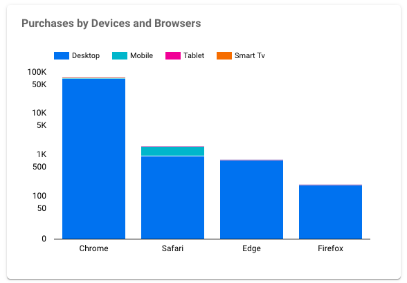

**Properties**

<table>
  <tr>
    <td><p><strong>Type</strong></p></td> 
    <td><p>Stacked column chart</p></td>
  </tr>
  <tr>
    <td><p><strong>Data Source</strong></p></td> 
    <td><p>MDS GA4 Session Device</p></td>
  </tr>
  <tr>
    <td><p><strong>Date Range Dimension</strong></p></td> 
    <td><p>event_date</p></td>
  </tr>
  <tr>
    <td><p><strong>Dimension</strong></p></td> 
    <td><p>device_web_browser</p></td>
  </tr>
  <tr>
    <td><p><strong>Breakdown Dimension</strong></p></td> 
    <td><p>device_category</p></td>
  </tr>
  <tr>
    <td><p><strong>Sort</strong></p></td> 
    <td><p>SUM(total_purchase_revenue)</p></td>
  </tr>
</table>

**Metrics**

```
SUM(total_purchase_revenue)
```

---

### Map


#### Sessions by Region 

**Properties**

<table>
  <tr>
    <td><p><strong>Type</strong></p></td> 
    <td><p>Heatmap (Geo)</p></td>
  </tr>
  <tr>
    <td><p><strong>Data Source</strong></p></td> 
    <td><p>MDS GA4 Session Location</p></td>
  </tr>
  <tr>
    <td><p><strong>Location</strong></p></td> 
    <td><p>region</p></td>
  </tr>
</table>

**Metrics**

```
SUM(session_count)
```

## Dashboard Deployment

The process is orchestrated through the [Looker Studio Linking API](https://developers.google.com/looker-studio/integrate/linking-api) and is documented in detail within the public repo.

[https://github.com/GoogleCloudPlatform/marketing-analytics-jumpstart/tree/main/python/lookerstudio](https://github.com/GoogleCloudPlatform/marketing-analytics-jumpstart/tree/main/python/lookerstudio)
