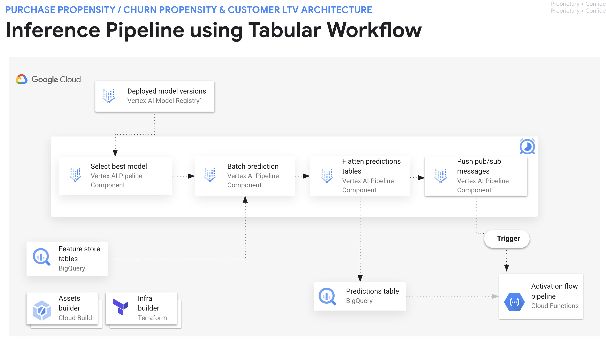
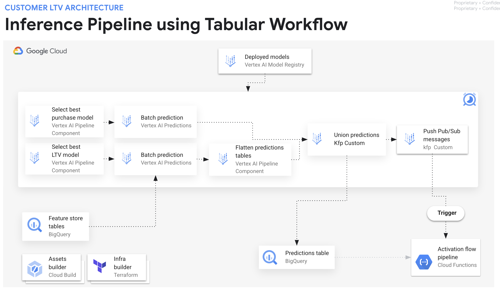
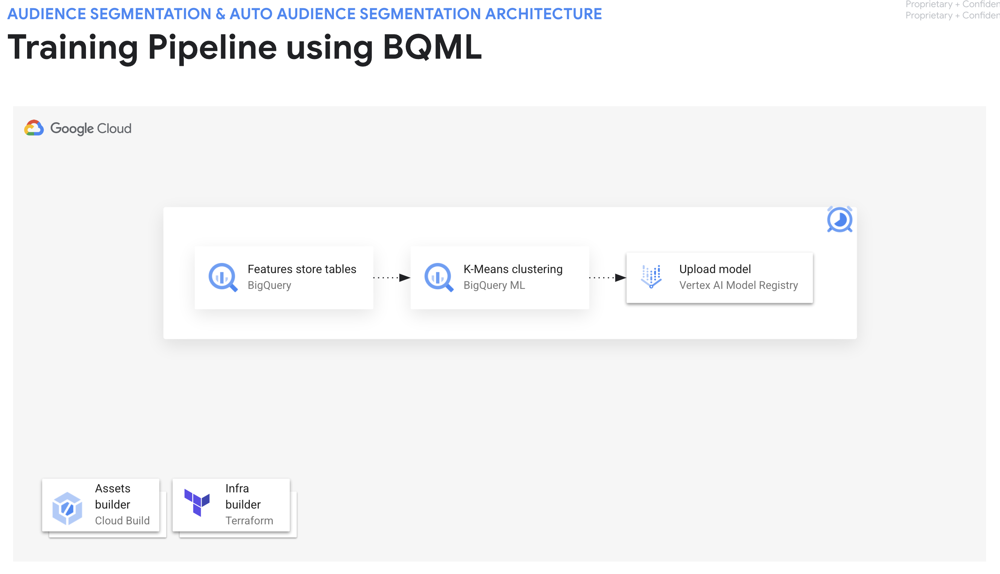
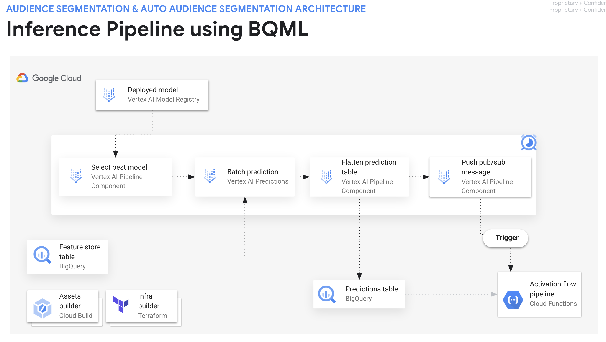

# Machine Learning (ML) Pipelines Guide

## Introduction

The Machine Learning (ML) pipelines component involves leveraging ML models and building pipelines to automate and orchestrate the training and prediction tasks to obtain the predictive insights to be sent via the Activation Application and to presented in the Reporting dashboards.

## Overall Solution Architecture

This architecture diagram illustrates the process of training and running prediction for machine learning models. The core components are:

* **Feature Store**: This is a central repository where features used to train the model are stored. It's designed for efficient access and management of features, ensuring consistency and reusability across different ML models. In the feature store, labels, dimensions and metrics are stored in tables in BigQuery.
* **Training pipeline**: This component involves training a model on Vertex AI using the training data stored in BigQuery tables, evaluating the model using the evaluation data, optionally, obtaining feature importance, and uploading the new model version to the Vertex AI Model Registry. It might include tasks like handling missing values, ranking and selecting features, converting data types, scaling values, running hyperparameter tuning, distilling and more.
* **Inference pipeline**: This component involves selecting the best model version, running batch prediction using the feature store data, prepare the predictions table and publishing a pub/sub message to trigger the Activation application.

**Benefits of this Architecture**
* **Pipeline Consistency**: The ML pipelines ensures that all models use the same, consistent pipeline steps, reducing errors and enabling troubleshooting model performance.
* **Reduced time to value**: Models can be deployed and used in production leveraging serverless data and AI platforms, BigQuery and Vertex AI. Without incurring managing and maintaining the typical infrastructure required.
* **Customization**: Bring your own model, customize the training and inference pipelines and leverage state of the art models, including GenAI models.

In essence, this architecture provides a streamlined and efficient way to build and deploy machine learning models for marketing analytics using Google Cloud BigQuery and Vertex AI.

## Implemented Architectures

This architecture diagram illustrates the process of training and deploying ML models using Tabular Workflows. All these stepsand other more are implemented in the Tabular Workflows, its main core components are:

* **Data Source**: This represents the use case prepared training dataset, present in BigQuery, prepared as a result of the feature engineering pipeline.
* **Model Training**: The prepared data is then used to train a machine learning model. Tabular Workflows supports various model types, including linear regression, logistic regression, and decision trees.
* **Model Evaluation**: The trained model is evaluated on a separate dataset to assess its performance. This helps determine how well the model generalizes to unseen data.
* **Feature Importance**: The trained model is analyzed to identify the most important features that contribute to the model's predictions using the unseen dataset.
* **Model Upload**: The trained model is registered into Vertex AI Model Registry and becomes available for deployment to an endpoint, or to be use in batch prediction. 

**Benefits of this Architecture**
* Simplified Workflow: Tabular Workflows provides a user-friendly interface for managing and triggering ML pipelines, simplifying the process of hyperparameter tuning, training and deploying models.
* Scalability: Tabular Workflows can handle large datasets and complex models, making it suitable for real-world marketing analytics applications.
* Integration with BigQuery: The seamless integration with BigQuery allows for efficient data storage, processing, and model deployment.
* Automated Pipelines: Tabular Workflows automates the entire ML pipeline, from data ingestion to model deployment, reducing manual effort and ensuring consistency.
* Parametrization and Setting Defaults: Tabular Workflows enables defining default parameters to ensure speed and reproducibility.

This architecture diagram illustrates the process of producing predictions, storing them in BigQuery, and triggering the Activation Application. The core components are:

* **Data Source**: This represents the use case prepared prediction dataset, in BigQuery, prepared as a result of the feature engineering pipeline.
* **Select Best Model**: The best performant model version according to an evaluation metric and a threshold is selected to be used in the further steps.
* **Model Batch Prediction**: The selected model is used for batch prediction using the features prepared for prediction. The predictions results are saved in BigQuery and used in the next steps.
* **Prepare Predictions**: Transform and prepare the predictions for them to be ready for ingestion by the Activation application.  
* **Trigger Activation Pipeline**: Send a pub/sub message to trigger the application pipeline providing the prediction table and the use case parameters.

In essence, this architecture provides a streamlined and efficient way to make predictions using Google Cloud's Tabular Workflows, enabling you to leverage your trained models for real-world marketing insights.

This architecture diagram illustrates the process of running inference pipeline using Tabular Workflow for a sophisticated process that takes two models predictions into account to produce the desired insights. The key differences are:

* **Select best model version for a purchase propensity and a customer lifetime value revenue regression models**: In this case, select a purchase propensity (classification) and a customer lifetime value (regression) model versions based on a key evaluation metric and thresholds. These models must produce predictions taking into consideration the same look ahead nunber of dates. For instance, a 30 day look ahead trained purchase propensity model and a 30 day look ahead trained customer lifetime value model is selected to provide customer lifetime value insights in the future 30 days.
* **Union model predictions and apply rule to produce final prediction values**: By taking these two raw predictions as inputs for this step, we can apply a rule that will produce the final prediction value to be stored in the predictions table. In this case, the logic implemented is to attribute 0.0 as final customer lifetime value revenue gain in case the user has a purchase probability lower than a threshold percentage; or else, use the raw prediction from the customer lifetime value model if the purchase probability is higher.

This architecture diagram illustrates the process of training and deploying ML models using [BigQuery ML](https://cloud.google.com/bigquery/docs/bqml-introduction) (BQML). All these steps are implemented as Vertex AI Pipeline components that are executed in BigQuery, its main core components are:

* **Ingest data source**: The Feature Store training preparation stored procedures prepares the data to be ingested by the BigQuery ML model. Using a single DML statement, BigQuery trigger the training routine, feeds the data to train the model and at the end uploads the trained model to Vertex AI.
* **Train and evaluate a BigQuery ML model**: BigQuery trains the Machine Learning model using its compute and data platform.
* **Upload the model to Vertex AI Model Registry**: The model is available under the BigQuery dataset related to the use case and registered in Vertex AI Model Registry, becoming easy to govern and discover.

This architecture diagram illustrates the process of running the BQML model prediction pipeline. All these steps are implemented as Vertex AI Pipeline components that are executed in BigQuery, its main core components are:

* **Data Source**: The feature inference preparation stored procedure prepares the data to be served as input for batch prediction.
* **Select best model version**: The model version that performs best according to a defined evaluation metric and a threshold is selected for batch prediction.
* **Batch prediction**: The raw predictions are produced.
* **Prepare model for prediction**: The predictions are prepared and saved in BigQuery in a format to be consumed by the Activation application.
* **Trigger activation application**: A pub/sub message is sent to trigger the Activation application by providing the adequate parameters related to the use case.

This architecture diagram illustrates the process of running the reporting data preparation and gemini insights pipelines. All these steps are implemented as Vertex AI Pipeline components that are executed in BigQuery, its main core components are:

* **Data sources**: For the aggregated predictions stored procedure, the latest predictions are joined for all users which contains all the use case predictions. This singl table is used as single pane of glass to build reports on Looker.
* **Aggregate predictions from all use cases**: Dynamically identify the latest predictions table for each use case and prepares the final joined table.
* **Aggregate daily/weekly/monthly metrics and generate Gemini insights**: Ingest users revenue and behaviour metrics daily features and aggregates them daily, weekly and monthly to prompt Gemini 1.5 via the BigQuery external connection to Vertex AI. 
* **Store aggregated predictions for all users**: Stores the joined predictions in a BigQuery table for further consumption in Looker reports.
* **Store generated insights**: Stores the generated insights in BigQuery tables for further consumption in Looker reports. 

## Who is this solution for?

We heard common stories from customers who were struggling with three frequent objectives:

1. **Data Scientists and ML Engineers looking into implement an end-to-end production ready, flexible and customizable ML pipelines to train and serve models to solve for common marketing analytics use cases: purchase propensity, customer lifetime value, audience segmentation, churn propensity**
    - These teams need a framework that can help them to quickly and easily deploy and scale ML models.
    - The ML Pipeline provides a framework that can be used to build and deploy ML models. This framework can help to reduce the time and effort required to deploy and scale ML models.

2. **Data Scientist establishing thought leadership and guidelines for choosing the machine learning model techniques and the decision making process**
    - These Data Scientists needs a library that can help them perform feature selection, feature transformation, hyperparameter tuning, model architecture search, model evaluation, model versioning, and select the best model for prediction.
    - The ML Pipelines provides a library that can be used to evaluate and compare different ML models. This library can help to select the best ML model for a given use case.

3. **ML Engineers building automated production ready MLOps pipelines and processes using features from data extracted from the Marketing Data Warehouse**
    - These teams need a platform and a library that can help them to automate the deployment and management of ML models.
    - The ML Pipelines provides reusable components and mechanisms to recompile pipelines that are used to automate the deployment of training and prediction pipelines of the ML models. This platform can help to improve the efficiency and reproducibility of ML models training and prediction.

## Benefits of this solution

After deploying the ML Pipelines component, Marketing Technology teams get the following benefits:

1. Understand and apply machine learning design principles and MLOps practices using a robust ML platform via Vertex AI.
2. Ingest features from the Feature Store built in BigQuery and store batch predictions back in BigQuery via native integrations.
3. Explainability of model performance by providing evaluation metrics and feature importance for further investigation.
4. Simplified pipelines orchestration and manual reproducibility via an unified ML platform, Vertex AI.
5. Reusable components to implement new use cases in a shorter time.

## Benefits of Tabular Workflows

The following are some of the benefits of Tabular Workflow for End-to-End AutoML :

* Supports large datasets that are multiple TB in size and have up to 1000 columns.
* Allows you to improve stability and lower training time by limiting the search space of architecture types or skipping architecture search.
* Allows you to improve training speed by manually selecting the hardware used for training and architecture search.
* Allows you to reduce model size and improve latency with distillation or by changing the ensemble size.
* Each AutoML component can be inspected in a powerful pipelines graph interface that lets you see the transformed data tables, evaluated model architectures, and many more details.
* Each AutoML component gets extended flexibility and transparency, such as being able to customize parameters, hardware, view process status, logs, and more.

For more details, visit the Tabular Workflows End-to-End official [documentation](https://cloud.google.com/vertex-ai/docs/tabular-data/tabular-workflows/overview).

## Advantages of the solution

In comparison to other approaches, ML Pipelines solution offers the following advantages:

* Provide configurations to customize and build parsimonious models by automatic identifying the right number of clusters for the use cases involving clustering techniques
    * Enabling choosing between statistical, Tree-based, Dense Neural Networks and Attention based modelling techniques.
* Solve common modelling and deployemnt challenges by providing a quick to deploy library around Vertex AI by mkaing the MLOps processes and tasks easier to be implemented by the adoption of Tabular Workflows and other Vertex AI components including: Templating, scheduler, model metadata, model registry ad integration with BigQuery.
    * Manage feature engineering, training and inference pipelines via configuration files or via the Vertex AI UI.
    * Obtaining explainability and transparency on feature importance and model evaluation metrics via the Vertex AI UI.
* ML Pipelnes expedites modelling time and provide a quicker time to value for more sophisticated production-level predictive and generative ai modelling by establishing a common code foundation in place that enables reuse of pipelines to solve marketing use cases and obtain insights.

## Advantages of Tabular Workflows

In comparison to other approaches, Tabular Workflow offers customers with the following advantages: 

* Easy to use Tabular Transformers-based models for custom propensity use cases: 

    Tabular Workflow for TabNet is a pipeline that you can use to train classification or regression models. TabNet uses sequential attention to choose which features to reason from at each decision step. This promotes interpretability and more efficient learning because the learning capacity is used for the most salient features.

* Easy to use Click-Through-Rate models for custom recommender systems (ecommerce product recommendation, ads recommendation):

    Tabular Workflow for Wide & Deep is a pipeline that you can use to train classification or regression models. Wide & Deep jointly trains wide linear models and deep neural networks. It combines the benefits of memorization and generalization. In some online experiments, the results showed that Wide & Deep significantly increased Google store application acquisitions compared with wide-only and deep-only models.

* Easy to use Time series Forecasting models for demand forecasting use cases. Check modelling [methods](https://cloud.google.com/vertex-ai/docs/tabular-data/forecasting-parameters#training-methods) :

    * Time series Dense Encoder (TiDE): Optimized dense DNN-based encoder-decoder model. Great model quality with fast training and inference, especially for long contexts and horizons. Learn [more](https://arxiv.org/abs/2304.08424). 
    * Temporal Fusion Transformer (TFT): Attention-based DNN model designed to produce high accuracy and interpretability by aligning the model with the general multi-horizon forecasting task. Learn [more](https://ai.googleblog.com/2021/12/interpretable-deep-learning-for-time.html).
    * AutoML (L2L): A good choice for a wide range of use cases. Learn [more](https://ai.googleblog.com/2020/12/using-automl-for-time-series-forecasting.html).
    * Seq2Seq+: A good choice for experimentation. The algorithm is likely to converge faster than AutoML because its architecture is simpler and it uses a smaller search space. Our experiments find that Seq2Seq+ performs well with a small time budget and on datasets smaller than 1 GB in size.
    * Prophet: Designed for a single time series. Vertex AI aggregates data by time series ID and trains a Prophet model for each time series. The model training pipeline performs hyperparameter tuning using grid search and Prophet's built-in backtesting logic. Learn [more](https://cloud.google.com/vertex-ai/docs/tabular-data/forecasting-prophet).
    * ARIMA+: BigQuery ML ARIMA_PLUS attempts to decompose each time series into trends, seasons, and holidays, producing a forecast using the aggregation of these models' predictions. One of the many differences, however, is that BQML ARIMA+ uses ARIMA to model the trend component, while Prophet attempts to fit a curve using a piecewise logistic or linear model. Learn [more](https://cloud.google.com/vertex-ai/docs/tabular-data/forecasting-arima/overview).

## ML Pipelines used by each Use Case

The ML Pipelines already implemented and used by each use case are listed below:

| Use Case | Vertex AI Pipeline | Pipeline Name | BigQuery Dataset | 
| -------- | ------- | -------------- | ---- |
| Purchase Propensity | [purchase_propensity_training_pipeline](../python/pipelines/pipeline_ops.py)   [purchase_propensity_prediction_pipeline](../python/pipelines/tabular_pipelines.py) | [purchase-propensity-training-pl](images/pipeline_purchase_propensity_training_uploaded.png)   [purchase-propensity-prediction-pl](images/pipeline_purchase_propensity_prediction_uploaded.png) | [purchase_propensity](../infrastructure/terraform/modules/feature-store/bigquery-datasets.tf) |
| Churn Propensity | [purchase_propensity_training_pipeline](../python/pipelines/pipeline_ops.py)   [purchase_propensity_prediction_pipeline](../python/pipelines/tabular_pipelines.py) | [purchase-propensity-training-pl](images/pipeline_purchase_propensity_training_uploaded.png)   [purchase-propensity-prediction-pl](images/pipeline_purchase_propensity_prediction_uploaded.png) | [purchase_propensity](../infrastructure/terraform/modules/feature-store/bigquery-datasets.tf) |
| Customer Lifetime Value | [purchase_propensity_training_pipeline](../python/pipelines/pipeline_ops.py)   [purchase_propensity_prediction_pipeline](../python/pipelines/tabular_pipelines.py) | [purchase-propensity-training-pl](images/pipeline_purchase_propensity_training_uploaded.png)   [purchase-propensity-prediction-pl](images/pipeline_purchase_propensity_prediction_uploaded.png) | [purchase_propensity](../infrastructure/terraform/modules/feature-store/bigquery-datasets.tf) |
| Demographic Audience Segmentation | [purchase_propensity_training_pipeline](../python/pipelines/pipeline_ops.py)   [purchase_propensity_prediction_pipeline](../python/pipelines/tabular_pipelines.py) | [purchase-propensity-training-pl](images/pipeline_purchase_propensity_training_uploaded.png)   [purchase-propensity-prediction-pl](images/pipeline_purchase_propensity_prediction_uploaded.png) | [purchase_propensity](../infrastructure/terraform/modules/feature-store/bigquery-datasets.tf) |
| Interest based Audience Segmentation | [purchase_propensity_training_pipeline](../python/pipelines/pipeline_ops.py)   [purchase_propensity_prediction_pipeline](../python/pipelines/tabular_pipelines.py) | [purchase-propensity-training-pl](images/pipeline_purchase_propensity_training_uploaded.png)   [purchase-propensity-prediction-pl](images/pipeline_purchase_propensity_prediction_uploaded.png) | [purchase_propensity](../infrastructure/terraform/modules/feature-store/bigquery-datasets.tf) |
| Aggregated Value Based Bidding | [purchase_propensity_training_pipeline](../python/pipelines/pipeline_ops.py)   [purchase_propensity_prediction_pipeline](../python/pipelines/tabular_pipelines.py) | [purchase-propensity-training-pl](images/pipeline_purchase_propensity_training_uploaded.png)   [purchase-propensity-prediction-pl](images/pipeline_purchase_propensity_prediction_uploaded.png) | [purchase_propensity](../infrastructure/terraform/modules/feature-store/bigquery-datasets.tf) |

## ML Pipelines Desing Principles

## Deploy ML Pipelines

## What is deployed to Google Cloud?

## Manually Triggering ML Pipelines

## Customize Training and Prediction Pipelines

## Customize Tabular Workflows Pipelines

## Implement new Custom and Tabular Workflows Pipelines

## Implement a new ML use case
To implement a new ML use case reusing as much as the MAJ existing code and following similar design principles you need to do the following code changes and additions.

### Changes:
1. Configuration (`config.yaml.tftpl`): Adjust configuration settings to accommodate the new use case model. This must include define parameters for the model, feature store, or pipeline.
    * New Pipeline Definition: A new pipeline named `feature-creation-use-case-name` is added to the configuration. This pipeline orchestrates the feature engineering steps required for the use case model.
    * Detailed Parameters: The configuration specifies parameters for this new pipeline, including:
        * Execution Details: Name, job ID prefix, experiment name, and type (custom).
        * Schedule: Cron schedule for pipeline execution (e.g. daily at 1 AM, New York timezone).
        * Pipeline Parameters: SQL queries for the use case label calculation, other features, inference preparation, and training preparation.
        * Substitutions: Variables for dynamic configuration (e.g., project ID, dataset names).
2. Infrastructure (`terraform/modules/feature-store/*.tf`): These Terraform files define the infrastructure for your feature store. Modifications related to adding tables, procedures, and a dataset to handle the new features required for feature engineering.
    * New Dataset: A new BigQuery dataset (user_case_name) is created to store data related to the use case training and inference pipelines.
    * New Tables: New BigQuery tables are created for storing the results of the use case inference and label preparation.
    * Procedures: New BigQuery stored procedures are added to handle inference and training preparation for the use case.
    * Pipelines: Terraform resources are added to compile, upload, and schedule the new use case feature engineering, training, and prediction pipelines.
3. Pipelines (`terraform/modules/pipelines/pipelines.tf`, `python/pipelines/*.py`): These changes manage the orchestration of your machine learning pipelines. Add new pipelines to handle feature engineering, model training, and prediction specifically for the new use case model.
    * Compiler: The `compiler.py` script is updated to recognize and handle the new use case feature engineering pipeline.
    * Feature Engineering: A new Python function (`use_case_name_feature_engineering_pipeline`) is added to define the feature engineering steps for the churn propensity model.
    * Scheduler: The scheduler.py script is modified to include the new use case training and prediction pipelines in the scheduling process.
    * Transformations (`python/pipelines/transformations-*.json`): This new file defines the transformations (feature engineering steps) required to prepare the raw data for the new use case model.
4. SQL Procedures (`sql/procedure/*.sqlx`): Add steps to prepare data for the new use case model.
    * New Procedures and Queries: New SQL procedures are created to handle:
        * Inference Preparation: Prepares data for predictions.
        * Label Calculation: Creates labels for training.
        * Training Preparation: Prepares data for training the model.
5. SQL Queries (`sql/query/invoke_*.sqlx`): The SQL code used to trigger the execution of the new SQL procedures: 
        * New SQL queries are added to invoke the new procedures for backfilling labels, inference preparation, and training preparation.
6. Table Schemas (`sql/schema/table/*.json`): New JSON files define the structure of new tables to store the results of inference preparation, labeling, and training preparation.

In this scenario, some of the features used in the purchase propensity model is being reused in this new use case model. If required, add more SQL procedures that will calculate the features for the new use case model.

## Monitoring and Troubleshooting
### Troubleshooting a Machine Learning Model
This section explains key takeaways from the book "Machine Learning Yearning" by Andrew Ng and how to apply them on the MAJ solution models. Besides, it also addresses a specific purchase propensity model, highlighting its exceptional performance but also raising concerns about overfitting, data leakage, and evaluation set bias. It suggests next steps like investigating overfitting, scrutinizing feature engineering, and evaluating the model on a more representative dataset.

Finally, it is confirmed the presence of data leakage in the model through one of the features and advises removing the leaky feature and retraining the model. Additional considerations are provided to avoid data leakage in the future, such as thorough data exploration, careful feature engineering, cross-validation, proper data splitting, and continuous performance monitoring.

#### Key Takeaways from "Machine Learning Yearning" book by Andrew Ng
Let's dive into the key takeaways from "Machine Learning Yearning" by Andrew Ng and how they apply to imbalanced classification problems, with a focus on bias, variance, and error analysis.

1. **Prioritize Rapid Iteration**: The book emphasizes the importance of quickly building and testing models. In imbalanced classification, this could mean starting with a simple model to establish a baseline performance.
2. **Match Your Development and Test Sets to Your Application**: Ensure your data reflects the real-world scenario. In imbalanced problems, this means having representative proportions of the minority class in both sets.
3. **Define a Single-Number Evaluation Metric**: Choose a metric that aligns with your project's goals. For imbalanced classification, accuracy alone is misleading. Instead, consider precision, recall, F1-score, or area under the ROC curve (AUC-ROC).
4. **Understand Your Data**: Analyze your data to identify potential biases. For imbalanced data, this could mean understanding why the minority class is underrepresented and how it might affect your model's predictions.
5. **Debug Using Bias and Variance**: These two concepts are crucial in understanding model errors. We'll delve into these in more detail below.
6. **Focus on End-to-End Performance**: Optimize the whole system, not just individual components. In imbalanced classification, this could mean combining models or using specialized techniques for the minority class.

#### Applying These Takeaways to Imbalanced Classification
1. **Rapid Iteration**: Start with a basic model (e.g., logistic regression) on a smaller dataset, then iterate and refine. This helps you understand the impact of different choices without investing too much time upfront.
2. **Data Matching**: Ensure your training and test sets have the same class distribution as the data you expect to see in production. This helps avoid surprises when your model is deployed.
3. **Choose the Right Metric**: For imbalanced problems, accuracy can be misleadingly high if the model simply predicts the majority class most of the time. Precision, recall, F1-score, and AUC-ROC offer better insights.
4. **Understand Data Bias**: If the minority class is underrepresented due to some systematic bias, your model might learn that bias. You may need to collect more data or use techniques to adjust for the imbalance.

**Bias and Variance Trade-off**
* **Bias**: A high-bias model is too simplistic, underfitting the data. It's unable to capture the underlying patterns, leading to poor performance on both training and test data.
* **Variance**: A high-variance model is too complex, overfitting the training data. It performs well on training data but poorly on new, unseen data due to noise and random fluctuations.

In imbalanced classification, a high-bias model might simply predict the majority class most of the time. A high-variance model might learn to fit the noise in the minority class data, leading to poor generalization.

**Error Analysis**
1. **Start Simple**: Begin with a simple model and gradually increase complexity.
2. **Examine Misclassifications**: Analyze the errors your model makes. Are they mostly false positives (incorrectly predicting the minority class) or false negatives (incorrectly predicting the majority class)?
3. **Look for Patterns**: Do the misclassified samples share any common characteristics? Are there certain regions of the feature space where the model performs poorly?
4. **Adjust Your Strategy**: Depending on the types of errors you observe, you might need to:
    * **Collect More Data**: Especially if the minority class is underrepresented.
    * **Change Your Model**: Try a more complex model if you suspect underfitting, or a simpler one if you suspect overfitting.
    * **Use Different Features**: If the model struggles in certain areas of the feature space, try adding, removing, or transforming features.

### Troubleshooting a Machine Learning Model's Performance

Let's take a purchase propensity model performance report as an example. This report is generated after your model is trained and evaluated on a test set using the Tabular Workflows Training pipeline.

According to the report bove, the model is performing exceptionally well, almost too well to be true. Here's a breakdown of the evaluation metrics and what they indicate:

**High-Level Metrics**
* ROC AUC: 100% This signifies the model has a perfect ability to distinguish between positive (likely to purchase) and negative (unlikely to purchase) cases across all possible classification thresholds. In other words, it perfectly ranks individuals based on their propensity to purchase.
* PRAUC: 100% Similar to ROC AUC, this metric focuses on the precision-recall trade-off, again indicating perfect performance in finding the positive cases while minimizing false positives.
* Precision, Recall, F1 Score (Micro-average): 99.9% These metrics reinforce the model's exceptional performance in identifying true positives (people likely to purchase). The micro-average focuses on overall performance across all instances.

**Confusion Matrix**
* True Positives (503): The model correctly identified 503 individuals likely to purchase.
* False Positives (4): It incorrectly predicted 4 individuals as likely to purchase when they weren't.
* False Negatives (1): It missed 1 person who was actually likely to purchase.
* True Negatives (5513): It correctly identified 5513 individuals as unlikely to purchase.

**Feature Importance**

The most important features are centered around recent activity:
- `device_web_browser_version`, 
- `visits_past_8_14_day`, `user_ltv_revenue`
- `active_users_past_15_30_day`, `device_os_version`
- `active_users_past_5_day`, `active_users_past_15_30_day`
- `geo_city`, `visits_past_15_30_day`

This suggests the model is heavily reliant on very recent user engagement to predict purchase propensity.

**Caveats and Considerations**

The fact that "device_web_browser_version" has a 70% feature importance is problematic and raises several concerns:
* **Unrealistic Predictive Power**: Web browser version alone is unlikely to be the sole or even primary driver of purchase decisions. Other factors like product interest, pricing, marketing campaigns, and user demographics typically play a more significant role. A 70% importance suggests the model is overly reliant on this feature, potentially overlooking these other crucial factors.
* **Potential Data Leakage**: It's possible this feature is acting as a proxy for other information that's not available during the actual prediction time. For instance, newer browser versions might be correlated with newer devices, which could be associated with higher purchasing power. Alternatively, specific marketing campaigns might target users of certain browsers, leading to a spurious correlation between browser version and purchases.
* **Generalization Issues**: The model's reliance on browser version might not generalize well to different populations or time periods. For example, if the training data was biased towards a particular browser version, the model might perform poorly on data where that version is less common.
* **Interpretability Challenges**: The high importance of this feature makes it difficult to explain the model's predictions to stakeholders. It's hard to justify why browser version would be such a dominant factor in purchase decisions, which can erode trust in the model's recommendations.
* **Business Implications**: If the model is used to inform business decisions, such as targeting specific browser versions with marketing campaigns, it could lead to misallocated resources and missed opportunities to reach potential customers who use different browsers.

**What to Do Next**
* **Investigate Data Leakage**: Carefully examine how the "device_web_browser_version" feature is collected and processed. Check for any potential leakage from the target variable (purchase) or other features that might introduce spurious correlations.
* **Feature Engineering**: Consider creating new features that capture the underlying reasons why browser version might be important. For example, you could create features based on device type, operating system, or user demographics that are correlated with browser usage.
* **Domain Expertise**: Consult with domain experts (marketing, product, etc.) to understand if the feature's importance aligns with their understanding of customer behavior. Their insights can help guide further investigation and feature engineering.

**Investigating Data Leakage**

During the investigation of data leakage, it was noticed that there are browser versions numbers (117, 119, 120) that only shows up for users who have purchased, with label will_purchase equals to "1". This is illustrated by the screenshots above.

This is problematic because during training, your model will learn to associate specific browser versions with positive outcomes, leading to artificially inflated performance metrics. However, when the model is deployed to predict purchase behavior for users daily, it will have access to their latest browser version information, and its performance will likely degrade significantly.

**Consequences of Data Leakage**
* **Overly Optimistic Performance**: The model's performance metrics (ROC AUC, precision, recall, etc.) are artificially inflated due to this leakage. It's essentially cheating on the test set.
* **Poor Generalization**: In real-world scenarios where the browser version is not known for potential customers, the model will likely perform significantly worse than indicated by the evaluation metrics.

    

    According to the propensity score deciles distribution, the model predicts an average purchase propensity score of 24% which is unrealistic for this ecommerce dataset. 
* **Misleading Feature Importance**: The high importance of the device_web_browser_version feature is a direct consequence of the leakage, not a genuine indicator of its predictive power.

**Resolving the Data Leakage Problem**

Removing the leaky feature and retraining the model is the correct course of action. This ensures that your model is learning from genuine predictors of purchase behavior rather than relying on information that won't be available during real-world predictions.

## Reporting ML Pipelines runs