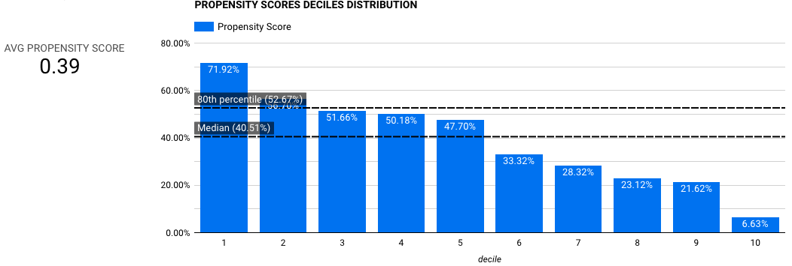
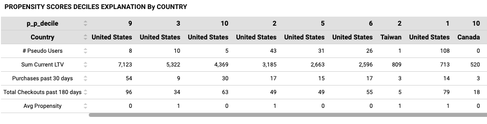
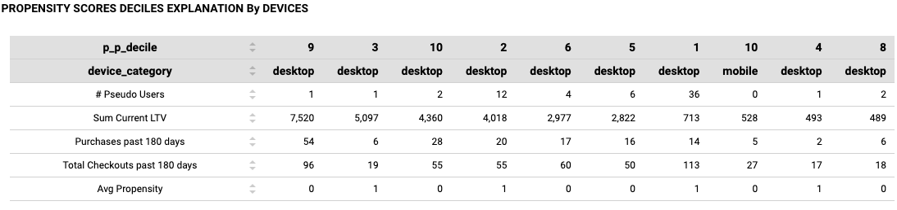

# Analyze Prediction Results
To help you analyze your prediction results, we have built dedicated pages in the MAJ dashboard to visualize and interpret the prediction data. These visualizations provide insights into the distribution of predicted values, user properties of each predicted segment (e.g., geographical location, devices, traffic source), and other relevant information.

The following table summarizes the information surfaced by the dashboard for each supported use case:
| Use Case | Metrics	| Sample |
| -------- | ------- | --------- |
| Purchase Propensity | Average propensity score Distibution over decile segments |	 |
| Purchase Propensity | Country distribution over decile segments |	 |
| Purchase Propensity | Device distribution over decile segments |  |
