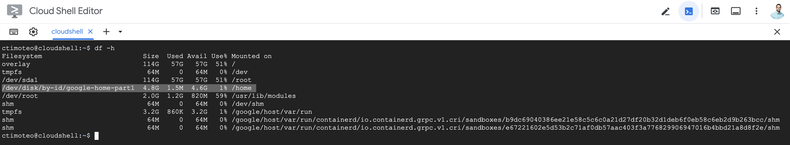

# Manual Installation of Terraform Modules

The Terraform scripts in this folder and subfolders create the infrastructure to start data ingestion
into BigQuery, create feature store, run ML pipelines and Dataflow activation application.

## Prerequisites

Make sure the prerequisites listed in the [parent README](../README.md) are met. 

You can run the script
from [Cloud Shell](https://cloud.google.com/shell/docs/using-cloud-shelld.google.com/shell/docs/using-cloud-shell)
or a Linux machine or a Mac with `gcloud` command installed. The instructions provided are for the Cloud Shell
installation.

**Note:** Before installing via Cloud Shell, make sure you have a clean persistent disk in your Cloud Shell. You should 
have plenty of disk space before continuing the installation.


If that is not your case, following the Cloud Shell documentation to [reset your Cloud Shell](https://cloud.google.com/shell/docs/resetting-cloud-shell).

## Manual Installation Guide

In this section, you find all the detailed steps required for you to manually install the Marketing Analytics Jumpstart solution. Following this process, you have greater flexibility and customization allowing you to choose which components of the solution you want to use or not.

Also, this method allows you to extend this solution and develop it to satisfy your own needs.

### Initial Environment Setup

1. Clone the source code repository:

    ```bash
    REPO="marketing-analytics-jumpstart"
    cd $HOME
    git clone https://github.com/GoogleCloudPlatform/${REPO}.git
    ```

1. If you don't use Cloud Shell, export environment variables and set the default project.
   Typically, there is a single project to install the solution. If you chose to use multiple projects - use the one
   designated for the data processing.

    ```bash
    export PROJECT_ID="[your Google Cloud project id]"
    gcloud config set project $PROJECT_ID
    ```

1. Install update uv for running python scripts
    Install [uv](https://docs.astral.sh/uv/) that manages the python version and dependecies for the solution.

    ```sh
    curl -LsSf https://astral.sh/uv/install.sh | sh
    export PATH="$HOME/.local/bin:$PATH"
    ```

    Check uv installation:
    ```sh
    uv --version
    ```

1. Authenticate with additional OAuth 2.0 scopes needed to use the Google Analytics Admin API:
   ```shell
   gcloud auth login
   gcloud auth application-default login --quiet --scopes="openid,https://www.googleapis.com/auth/userinfo.email,https://www.googleapis.com/auth/cloud-platform,https://www.googleapis.com/auth/sqlservice.login,https://www.googleapis.com/auth/analytics,https://www.googleapis.com/auth/analytics.edit,https://www.googleapis.com/auth/analytics.provision,https://www.googleapis.com/auth/analytics.readonly,https://www.googleapis.com/auth/accounts.reauth"
   gcloud auth application-default set-quota-project $PROJECT_ID
   export GOOGLE_APPLICATION_CREDENTIALS=/Users/<USER_NAME>/.config/gcloud/application_default_credentials.json
   ```

    **Note:** You may receive an error message informing the Cloud Resource Manager API has not been used/enabled for your project, similar to the following: 
    
    ERROR: (gcloud.auth.application-default.login) User [<ldap>@<company>.com] does not have permission to access projects instance [<gcp_project_ID>:testIamPermissions] (or it may not exist): Cloud Resource Manager API has not been used in project <gcp_project_id> before or it is disabled. Enable it by visiting https://console.developers.google.com/apis/api/cloudresourcemanager.googleapis.com/overview?project=<gcp_project_id> then retry. If you enabled this API recently, wait a few minutes for the action to propagate to our systems and retry.

    On the next step, the Cloud Resource Manager API will be enabled and, then, your credentials will finally work.

1. Review your Terraform version

    Make sure you have installed terraform version is 1.9.7. We recommend you to use [tfenv](https://github.com/tfutils/tfenv) to manage your terraform version.
   `Tfenv` is a version manager inspired by rbenv, a Ruby programming language version manager.

    To install `tfenv`, run the following commands:

    ```shell
    # Install via Homebrew or via Arch User Repository (AUR)
    # Follow instructions on https://github.com/tfutils/tfenv

    # Now, install the recommended terraform version 
    tfenv install 1.9.7
    tfenv use 1.9.7
    terraform --version
    ```

    **Note:** If you have a Apple Silicon Macbook, you should install terraform by setting the `TFENV_ARCH` environment variable:
    ```shell
    TFENV_ARCH=amd64 tfenv install 1.9.7
    tfenv use 1.9.7
    terraform --version
    ```
    If not properly terraform version for your architecture is installed, `terraform .. init` will fail.

    For instance, the output on MacOS should be like:
    ```shell
    Terraform v1.9.7
    on darwin_amd64
    ```

1. Run the following script to create a Terraform remote backend. 

    Terraform stores state about managed infrastructure to map real-world resources to the configuration, keep track of metadata, and improve performance. Terraform stores this state in a local file by default, but you can also use a Terraform remote backend to store state remotely. [Remote state](https://developer.hashicorp.com/terraform/cdktf/concepts/remote-backends) makes it easier for teams to work together because all members have access to the latest state data in the remote store.

    ```bash
    cd ${SOURCE_ROOT}
    scripts/generate-tf-backend.sh
    ```

    **Note:** Make sure you have permissions to query the tables the BigQuery dataset where your GA4 and GAds exported data is located.

1. Create the Terraform variables file by making a copy from the template and set the Terraform variables.
   Most of the parameters are based on the pre-requisites described [here](../README.md).
   The [sample file](terraform-sample.tfvars) has all the required variables listed.

    ```bash
    TERRAFORM_RUN_DIR=${SOURCE_ROOT}/infrastructure/terraform
    cp ${TERRAFORM_RUN_DIR}/terraform-sample.tfvars ${TERRAFORM_RUN_DIR}/terraform.tfvars
   ```

   Edit the variables file. If using Vim:
   ```shell
    vim ${TERRAFORM_RUN_DIR}/terraform.tfvars
    ```

    **Note:** The variable `google_default_region` determines the region where the resources are hosted. The variable default value is `us-central1`, based on your data residency requirements you should change the variable value by add the following in your `terraform.tfvars` file:
    ```
    google_default_region = "[specific Google Cloud region of choice]"
    ```
    **Note:** The variable `destination_data_location` determines the location for the data store in BigQuery. You have the choice to either store the data in single region by assigning value such as
    * `us-central1`, `europe-west1`, `asia-east1` etc

    or in multi-regions by assigning value such as
    * `US` or `EU`

1. Run Terraform to initialize your environment, and validate if your configurations and variables are set as expected:

    ```bash
    terraform -chdir="${TERRAFORM_RUN_DIR}" init
    terraform -chdir="${TERRAFORM_RUN_DIR}" plan
    terraform -chdir="${TERRAFORM_RUN_DIR}" validate
    ```

    If you run into errors, review and edit the `${TERRAFORM_RUN_DIR}/terraform.tfvars` file. However, if there are still configuration errors, open a new [github issue](https://github.com/GoogleCloudPlatform/marketing-analytics-jumpstart/issues/).

1. Run Terraform to create resources:

    ```bash
    terraform -chdir="${TERRAFORM_RUN_DIR}" apply
    ```
    
   If you don't have a successful execution of certain resources, re-run `terraform -chdir="${TERRAFORM_RUN_DIR}" apply` a few more times until all is deployed successfully. However, if there are still resources not deployed, open a new [github issue](https://github.com/GoogleCloudPlatform/marketing-analytics-jumpstart/issues/).

### Resume terminal session

Because a Cloud Shell session is ephemeral, your Cloud Shell session could terminate for various reasons. When a terminal session ends all the session variables and user authentication are lost. You can run the `session-resume.sh` script to configure a new terminal session with the necessary environmental variables and authentication credentials to continue with the terraform deployment.

 **Note:** The prerequisites for running this script are that you have set all the variable values in the TF variables file `$TERRAFORM_RUN_DIR}/terraform.tfvars` and have applied the terraform configuration once before.

Reset your Google Cloud Project ID variables:

   ```bash
   export PROJECT_ID="[your Google Cloud project id]"
   gcloud config set project $PROJECT_ID
   ```

Follow the authentication workflow, since your credentials expires daily:

   ```bash
   # Authenticate your user to Google Cloud
   gcloud auth login
   # Authenticate your application default login to Google Cloud with the right scopes for Terraform to run
   gcloud auth application-default login --quiet --scopes="openid,https://www.googleapis.com/auth/userinfo.email,https://www.googleapis.com/auth/cloud-platform,https://www.googleapis.com/auth/sqlservice.login,https://www.googleapis.com/auth/analytics,https://www.googleapis.com/auth/analytics.edit,https://www.googleapis.com/auth/analytics.provision,https://www.googleapis.com/auth/analytics.readonly,https://www.googleapis.com/auth/accounts.reauth"
   gcloud auth application-default set-quota-project $PROJECT_ID
   export GOOGLE_APPLICATION_CREDENTIALS=/Users/<USER_NAME>/.config/gcloud/application_default_credentials.json
   ```

To resume working on a new terminal session run the following commands:

  ```bash
  # Change directory to the source code root directory
  SOURCE_ROOT="${HOME}/marketing-analytics-jumpstart"
  cd ${SOURCE_ROOT}
  TERRAFORM_RUN_DIR=${SOURCE_ROOT}/infrastructure/terraform
  export PATH="$HOME/.local/bin:$PATH" 
  # Resume the terminal session using values stored on Terraform outputs
  ./scripts/session-resume.sh
  ```

## Resources created

At this time, the Terraform scripts in this folder perform the following tasks:

- Enables the APIs needed
- IAM bindings needed for the GCP services used
- Secret in GCP Secret manager for the private GitHub repo
- Dataform repository connected to the GitHub repo
- Deploys the marketing data store (MDS), feature store, ML pipelines and activation application

## Next Steps

Follow the [post-installation guide](./POST-INSTALLATION.md) to start you daily operations.

It is recommended to follow the post-installation guide before deploying the Looker Studio Dashboard, because you need the data and predictions tables to exist before consuming insights in your reports.

**The Looker Studio Dashboard deployment is a separate [step](https://github.com/GoogleCloudPlatform/marketing-analytics-jumpstart/blob/main/python/lookerstudio/README.md).**


