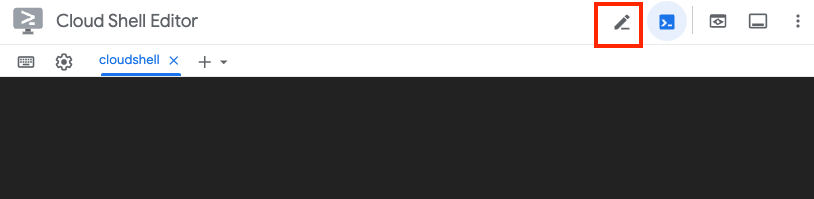

# Marketing Data Engine Looker Studio Dashboard

This Python script generates a URL to deploy a copy of the Marketing Data Engine dashboard utilizing the [Looker Studio Linking API](https://developers.google.com/looker-studio/integrate/linking-api).

The dashboard deployment is intended to be completed once the Marketing Data Engine warehouse has been deployed through Dataform.

Program requirements are listed in `pyproject.toml`.

You will need to configure `config.ini` with the BigQuery project and datasets for your warehouse.


## Environment Set-Up

1. If you haven't already, clone this repo to your Cloud Shell:
```bash
https://github.com/GoogleCloudPlatform/marketing-data-engine.git
```

1. Poetry is required for this deployment, if you haven't in a previous step, install it:
```bash
curl -sSL https://install.python-poetry.org | python3 -
```

1. Navigate to this directory and run Poetry to install requirements in a virtual environment:

```bash
cd python/lookerstudio
poetry install
```

This step includes the following:
- Clone repo (if necessary)
- Install Poetry (if necessary)
- Run Poetry to install project requirements

## Set-up Configuration

The file `config.ini` needs to be updated for the project and datasets where your Marketing Data Engine Dataform is deployed.

Specifically the following properties need to be set under the `[COMMON]` section:

```bash
[COMMON]
# TODO: Replace the values in this section with your own

project = project_id
ga4_dataset = marketing_ga4_v1_prod
ads_dataset = marketing_ads_v1_prod
```

You can use your favorite text editor such as vim, nano or even the built in editor in Cloud Console.



## Execute the script

You're ready to execute the script simply by running:

```bash
poetry run python lookerstudio_deployment.py
```

If execution is successful, you will see a long https://lookerstudio.google.com URL that creates a copy of the template report with your defined Marketing Data Engine datasets.

If there is an error, the script should output the appropriate error to help guide you in ensuring that you are executing with the right account and have appropriate permissions on the dataset.

Clicking on the link will open a new browser tab that executes the copy operation and you will see a screen similar to below. This copy may take a few moments to execute but if it does not, close the tab and try clicking the link again.


Click on **Edit and share** to continue the copy process.

## Review Access

Review the data source configuration settings and then click on **Acknowledge and Save** to continue.


Acknowledge the data sources you are adding to the report by clicking on **Add to report**.


A copy of the report named **Marketing Analytics Sample** is now saved to your own Looker Studio account.

## Configure Access

The data sources will default to owner credentials (your own). It is highly recommended that you either configure service account access or set the access to viewer so that each viewer will need viewer access to the product views in the datamart.