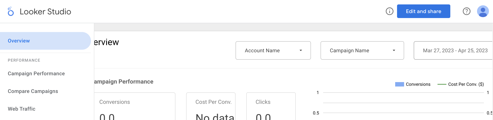
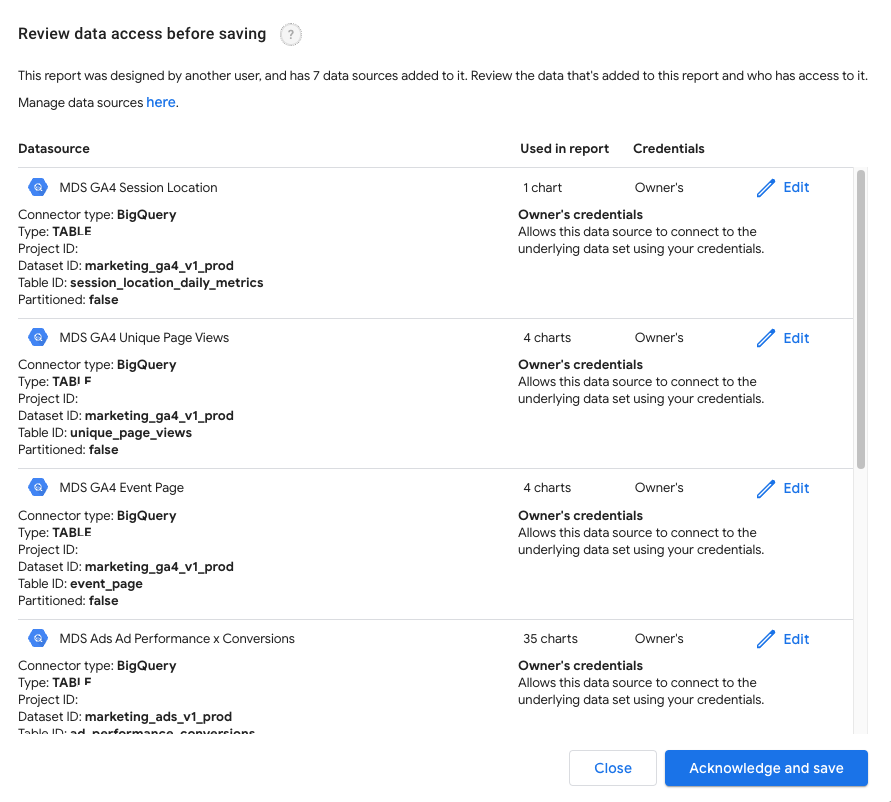
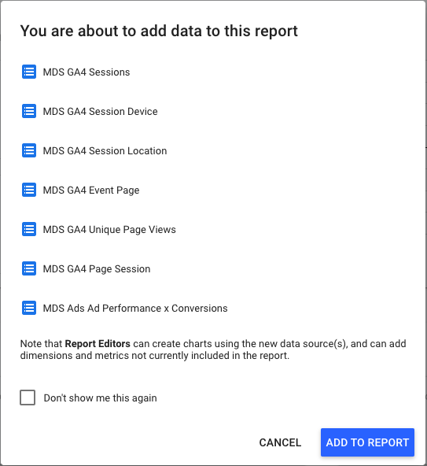

# Marketing Analytics Jumpstart Looker Studio Dashboard

## Prerequisites
This Looker Studio dashboard relies on specific BigQuery tables that should be present in your project. These tables are created during the deployment of the Marketing Analytics Jumpstart and by the data processing pipelines of the solution.
Before deploying the dashboard, make sure the pre-requisite tables exist. If tables are missing, ensure the corresponding pipelines have run successfully.

| Table |	Dataset | Source Process | Troubleshooting Link |
| -------- | ------- | ------- | --------- |
| session_date | marketing_ga4_v1_* | Dataform Execution| [Workflow Execution Logs](https://console.cloud.google.com/bigquery/dataform/locations/us-central1/repositories/marketing-analytics/details/workflows) |
| session_device_daily_metrics | marketing_ga4_v1_* | Dataform Execution| [Workflow Execution Logs](https://console.cloud.google.com/bigquery/dataform/locations/us-central1/repositories/marketing-analytics/details/workflows) |
| latest | aggregated_predictions | feature-store terraform module and aggregated_predictions.aggregate_last_day_predictions stored procedure | [Aggregating stored prodedure](https://console.cloud.google.com/bigquery?ws=!1m5!1m4!6m3!1s!2saggregated_predictions!3saggregate_last_day_predictions) |
| resource_link | maj_dashboard | monitor terraform module | [Dashboard dataset](https://console.cloud.google.com/bigquery?ws=!1m4!1m3!3m2!1s!2smaj_dashboard) |
| dataform_googleapis_com_workflow_invocation_completion | maj_logs | monitor terraform module | [maj_logs dataset](https://console.cloud.google.com/bigquery?ws=!1m4!1m3!3m2!1s!2smaj_logs) |
| event | marketing_ga4_base_* | Dataform Execution | [Workflow Execution Logs](https://console.cloud.google.com/bigquery/dataform/locations/us-central1/repositories/marketing-analytics/details/workflows) |
| session_location_daily_metrics | marketing_ga4_v1_* | Dataform Execution | [Workflow Execution Logs](https://console.cloud.google.com/bigquery/dataform/locations/us-central1/repositories/marketing-analytics/details/workflows) |
| aggregated_value_based_bidding_volume_weekly | aggregated_vbb | feature-store terraform module and aggregated_vbb.invoke_aggregated_value_based_bidding_explanation_preparation stored procedure | [aggregated_value_based_bidding_explanation_preparation](https://console.cloud.google.com/bigquery?ws=!1m5!1m4!6m3!1s!2saggregated_vbb!3sinvoke_aggregated_value_based_bidding_explanation_preparation) |
| event_page | marketing_ga4_v1_* | Dataform Execution| [Workflow Execution Logs](https://console.cloud.google.com/bigquery/dataform/locations/us-central1/repositories/marketing-analytics/details/workflows) |
| unique_page_views | marketing_ga4_v1_* | Dataform Execution| [Workflow Execution Logs](https://console.cloud.google.com/bigquery/dataform/locations/us-central1/repositories/marketing-analytics/details/workflows) |
| aggregated_value_based_bidding_correlation | aggregated_vbb | feature-store terraform module and aggregated_vbb.invoke_aggregated_value_based_bidding_explanation_preparation stored procedure | [aggregated_value_based_bidding_explanation_preparation](https://console.cloud.google.com/bigquery?ws=!1m5!1m4!6m3!1s!2saggregated_vbb!3sinvoke_aggregated_value_based_bidding_explanation_preparation) |
| ad_performance_conversions | marketing_ads_v1_* | Dataform Execution | [Workflow Execution Logs](https://console.cloud.google.com/bigquery/dataform/locations/us-central1/repositories/marketing-analytics/details/workflows) |
| user_behaviour_revenue_insights_daily | gemini_insights | feature-store terraform module and gemini_insights.user_behaviour_revenue_insights stored procedure | [User Behaviour Revenue Insights](https://console.cloud.google.com/bigquery?ws=!1m5!1m4!6m3!1s!2sgemini_insights!3suser_behaviour_revenue_insights) |
| dataflow_googleapis_com_job_message | maj_logs | monitor terraform module | [maj_logs dataset](https://console.cloud.google.com/bigquery?ws=!1m4!1m3!3m2!1s!2smaj_logs) |
| vbb_weights | aggregated_vbb | feature-store terraform module and VBB explanation pipeline | [VBB Explanation Pipeline](https://console.cloud.google.com/vertex-ai/pipelines/schedules) |
| page_session_daily_metrics | marketing_ga4_v1_* | Dataform Execution| [Workflow Execution Logs](https://console.cloud.google.com/bigquery/dataform/locations/us-central1/repositories/marketing-analytics/details/workflows) |
| aiplatform_googleapis_com_pipeline_job_events | maj_logs | monitor terraform module | [maj_logs dataset](https://console.cloud.google.com/bigquery?ws=!1m4!1m3!3m2!1s!2smaj_logs) |
| aggregated_value_based_bidding_volume_daily | aggregated_vbb | feature-store terraform module and aggregated_vbb.invoke_aggregated_value_based_bidding_explanation_preparation stored procedure | [aggregated_value_based_bidding_explanation_preparation](https://console.cloud.google.com/bigquery?ws=!1m5!1m4!6m3!1s!2saggregated_vbb!3sinvoke_aggregated_value_based_bidding_explanation_preparation) |

## Extract Looker Studio dashboard URL
Extract the URL used to create the dashboard from the Terraform output value:

```sh
echo "$(terraform -chdir=${TERRAFORM_RUN_DIR} output -raw lookerstudio_create_dashboard_url)"
```

Click on the long URL from the command output that will open a new browser tab that executes the copy operation and you will see a screen similar to below. This copy may take a few moments to execute but if it does not, close the tab and try clicking the link again.



Click on **Edit and share** to continue the copy process.

## Review Access

Review the data source configuration settings and then click on **Acknowledge and Save** to continue.



Acknowledge the data sources you are adding to the report by clicking on **Add to report**.



A copy of the report named **Marketing Analytics Sample** is now saved to your own Looker Studio account.

## Configure Access

The data sources will default to owner credentials (your own). It is highly recommended that you either configure service account access or set the access to viewer so that each viewer will need viewer access to the product views in the datamart.
